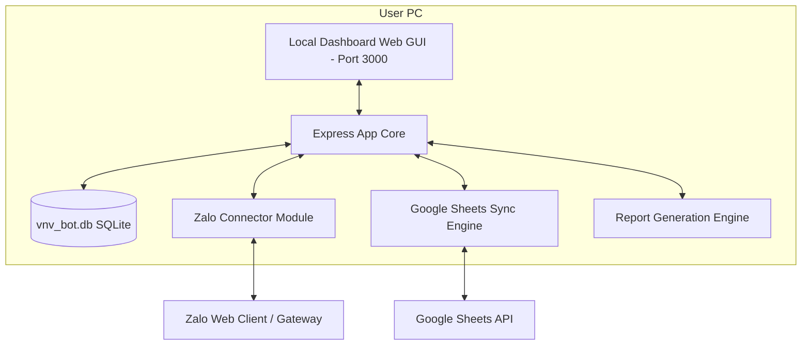
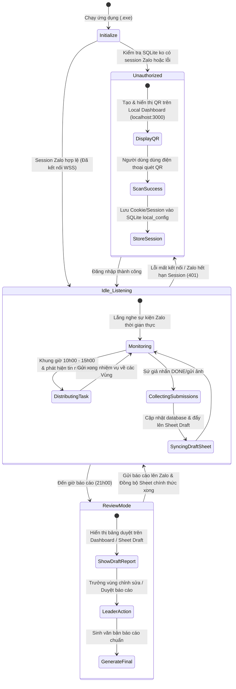
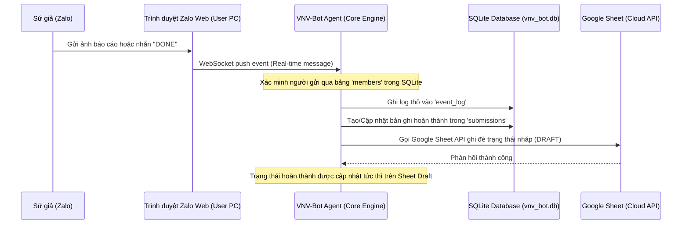
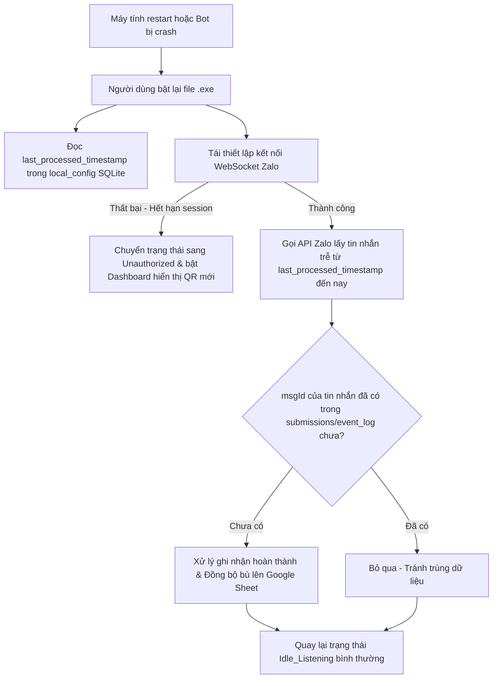
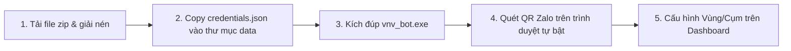

# ARCHITECTURE FREEZE DOCUMENT
# VNV-BOT V2 - LOCAL STANDALONE AGENT

- **Version:** 2.0 (Arch Freeze)
- **Status:** APPROVED & LOCKED
- **Owner:** Nguyễn Thuận An
- **Deployment Model:** Local Standalone Agent (No Cloud Server, No VPS, Free Tier)
- **Target Platform:** Windows 10/11 (x64)

---

## 1. MODULE BREAKDOWN

Thiết kế mô-đun của ứng dụng **Local Standalone Agent** được chia nhỏ thành các cấu phần độc lập nhằm tối ưu hóa bộ nhớ, hoạt động tốt trên máy tính văn phòng cấu hình thấp và dễ dàng đóng gói thành file chạy `.exe` duy nhất.



### 1.1 Local Web Dashboard GUI (Cổng quản trị cục bộ)
- **Công nghệ:** HTML5, Vanilla CSS, Vanilla JS được nhúng (serve) trực tiếp từ Node.js local server thông qua Express.
- **Chức năng:**
  - Hiển thị mã QR Code để người dùng scan đăng nhập Zalo.
  - Quản lý bảng Mapping Sứ giả tại địa phương (import/export CSV, thêm, sửa thành viên).
  - Giao diện cấu hình tham số: Tên các nhóm Zalo Vùng/Cụm, ID Google Sheet, API Keys.
  - Giao diện Duyệt Báo cáo nhanh (Manual Review Layer) trước khi gửi Zalo và đồng bộ Google Sheet.

### 1.2 Express Backend Engine (Nhân điều hướng)
- **Công nghệ:** Node.js, Express.js.
- **Chức năng:** Chạy ngầm như một Service cục bộ (localhost:3000), điều phối hoạt động giữa SQLite, Zalo API, Google Sheet API và định giờ (Cron Scheduler) thực hiện nhiệm vụ.

### 1.3 Zalo Connector Module (Kết nối Zalo)
- **Công nghệ:** WebSocket Client giả lập Zalo Web hoặc Chrome headless (Puppeteer-core điều khiển Chrome/Edge có sẵn trên máy người dùng).
- **Chức năng:**
  - Lắng nghe Event thời gian thực.
  - Tự động copy và chuyển tiếp nhiệm vụ trong khung giờ 10h00 - 15h00.
  - Gửi báo cáo Vùng/Cụm tự động vào các nhóm Zalo theo lịch trình.

### 1.4 Google Sheets Sync Engine (Đồng bộ Bảng tính)
- **Công nghệ:** Google APIs Client Library (`googleapis`).
- **Chức năng:** Đọc dữ liệu mapping từ Sheet, cập nhật trạng thái `OK` hoặc lý do không hoàn thành của Sứ giả trực tiếp từ SQLite lên Google Sheet.

### 1.5 Report Generation Engine (Động cơ sinh báo cáo)
- **Chức năng:** Thực hiện truy vấn dữ liệu từ SQLite cục bộ, render báo cáo theo format chuẩn VNV (sử dụng Template Engine đơn giản như Mustache hoặc String Interpolation).

---

## 2. LOCAL DATABASE SCHEMA (SQLITE)

Cơ sở dữ liệu SQLite (`vnv_bot.db`) được tự động khởi tạo trong thư mục cài đặt khi chạy ứng dụng lần đầu. Định dạng Schema tối giản để phục vụ chạy đơn bản (Standalone):

### 2.1 Bảng `local_config`
Lưu trữ các tham số cấu hình cài đặt cục bộ của Agent.

| Column | Type | Constraints | Description |
| :--- | :--- | :--- | :--- |
| `key` | TEXT | PRIMARY KEY | Cực khóa (ví dụ: `role_mode`, `zalo_cookie`, `sheet_id`) |
| `value` | TEXT | | Giá trị cấu hình |
| `updated_at` | TIMESTAMP | DEFAULT CURRENT_TIMESTAMP | Ngày cập nhật gần nhất |

### 2.2 Bảng `members`
Bảng Mapping danh sách Sứ giả do Trưởng Vùng/Cụm quản lý trực tiếp.

| Column | Type | Constraints | Description |
| :--- | :--- | :--- | :--- |
| `id` | INTEGER | PRIMARY KEY AUTOINCREMENT | Khóa chính |
| `real_name` | TEXT | NOT NULL | Họ tên khai sinh |
| `zalo_name` | TEXT | NOT NULL | Tên tài khoản Zalo hiển thị |
| `zalo_id` | TEXT | UNIQUE | ID tài khoản Zalo duy nhất |
| `region` | INTEGER | NOT NULL | Số vùng (từ 25 đến 31) |
| `role` | TEXT | DEFAULT 'Sứ giả' | Vai trò: `Sứ giả`, `Trưởng vùng`, `Trưởng cụm` |
| `status` | TEXT | DEFAULT 'Active' | Tình trạng: `Active`, `Inactive` |

### 2.3 Bảng `tasks`
Danh sách các nhiệm vụ ngày được Agent phát hiện và tải về.

| Column | Type | Constraints | Description |
| :--- | :--- | :--- | :--- |
| `id` | INTEGER | PRIMARY KEY AUTOINCREMENT | Khóa chính |
| `task_code` | TEXT | UNIQUE, NOT NULL | Mã ID nhiệm vụ (`TSK-YYYYMMDD-[HASH]`) |
| `zalo_source_msg_id` | TEXT | | ID tin nhắn gốc của nhiệm vụ trên Zalo |
| `title` | TEXT | | Tiêu đề tóm tắt |
| `description` | TEXT | NOT NULL | Nội dung chi tiết nhiệm vụ |
| `publish_date` | TEXT | NOT NULL | Ngày phân phối nhiệm vụ (YYYY-MM-DD) |
| `status` | TEXT | DEFAULT 'active' | Trạng thái nhiệm vụ: `active` hoặc `closed` |

### 2.4 Bảng `submissions`
Lịch sử ghi nhận hoàn thành nhiệm vụ của Sứ giả trong ngày.

| Column | Type | Constraints | Description |
| :--- | :--- | :--- | :--- |
| `id` | INTEGER | PRIMARY KEY AUTOINCREMENT | Khóa chính |
| `task_id` | INTEGER | FOREIGN KEY REFERENCES `tasks(id)` | Khóa ngoại trỏ đến nhiệm vụ |
| `member_id` | INTEGER | FOREIGN KEY REFERENCES `members(id)` | Khóa ngoại trỏ đến sứ giả |
| `zalo_msg_id` | TEXT | UNIQUE, NOT NULL | ID tin nhắn Zalo gửi bài (đảm bảo tính lũy đẳng) |
| `submission_type` | TEXT | | Hình thức nộp bài: `image` hoặc `keyword` |
| `raw_content` | TEXT | | Nội dung text hoặc đường dẫn ảnh cục bộ |
| `status` | TEXT | DEFAULT 'pending_review' | Trạng thái: `pending_review`, `approved`, `rejected` |
| `notes` | TEXT | | Lý do Trưởng vùng ghi chú (ví dụ: `SG ko phản hồi`) |
| `submitted_at` | TIMESTAMP | DEFAULT CURRENT_TIMESTAMP | Thời điểm nộp bài |

### 2.5 Bảng `reports`
Lịch sử báo cáo đã được sinh cục bộ.

| Column | Type | Constraints | Description |
| :--- | :--- | :--- | :--- |
| `id` | INTEGER | PRIMARY KEY AUTOINCREMENT | Khóa chính |
| `task_id` | INTEGER | FOREIGN KEY REFERENCES `tasks(id)` | Báo cáo thuộc nhiệm vụ nào |
| `total_members` | INTEGER | | Tổng số sứ giả thời điểm báo cáo |
| `total_completed` | INTEGER | | Số lượng hoàn thành |
| `total_failed` | INTEGER | | Số lượng chưa hoàn thành |
| `content` | TEXT | NOT NULL | Nội dung văn bản báo cáo hoàn chỉnh |
| `sent_at` | TIMESTAMP | | Thời điểm gửi lên nhóm Zalo thành công |

---

## 3. FOLDER STRUCTURE

Cấu trúc thư mục của dự án Agent cục bộ, đảm bảo tính đóng gói gọn gàng:

```text
vnv_bot/
├── data/
│   ├── vnv_bot.db         # Database SQLite cục bộ (Tự động sinh khi chạy app)
│   ├── credentials.json   # File key Google Sheet Service Account (Người dùng cấu hình)
│   └── logs/              # Thư mục chứa các file log ngày chạy ngầm
│       └── app-2026-06-18.log
├── src/
│   ├── config/
│   │   └── db.js          # Khởi tạo và thiết lập SQLite connection
│   ├── database/
│   │   └── schema.sql     # Các câu lệnh khởi tạo bảng SQLite
│   ├── services/
│   │   ├── zalo_client.js # Lắng nghe WebSocket & gửi tin nhắn Zalo Web
│   │   ├── sheet_sync.js  # Đồng bộ dữ liệu sang Google Sheet API
│   │   └── report_gen.js  # Engine tạo báo cáo theo mẫu
│   ├── web/               # Chứa giao diện Local Dashboard Web
│   │   ├── index.html     # Trang chủ Dashboard (localhost:3000)
│   │   ├── main.js        # Logic điều khiển Dashboard
│   │   └── style.css      # Giao diện điều khiển
│   ├── app.js             # Khởi tạo Express Server & Routing API
│   └── index.js           # Điểm khởi chạy ứng dụng (Entrypoint)
├── package.json           # File khai báo thư viện Node.js
└── pkg-config.json        # Cấu hình đóng gói ứng dụng Node.js thành EXE
```

---

## 4. STATE MACHINE (SƠ ĐỒ TRẠNG THÁI CỤC BỘ)

Agent hoạt động độc lập trên máy tính cá nhân dựa trên một máy trạng thái (State Machine) đơn giản để đảm bảo tính an toàn dữ liệu:



---

## 5. EVENT FLOW (LUỒNG SỰ KIỆN CHI TIẾT)

Mô tả luồng đi của dữ liệu từ khi Sứ giả gửi báo cáo hoàn thành trên Zalo đến khi dữ liệu được lưu trữ và đồng bộ cục bộ:



---

## 6. ERROR RECOVERY FLOW (LUỒNG PHỤC HỒI LỖI CỤC BỘ)

Vì chạy trên máy tính cá nhân của người dùng, sự cố tắt máy đột ngột, mất kết nối internet hoặc Zalo bị logout là không thể tránh khỏi. Dưới đây là quy trình tự động tự sửa lỗi (Self-healing):



---

## 7. PACKAGING STRATEGY (.EXE)

Để đảm bảo **Goal 4 của PRD** (Không yêu cầu người dùng cài đặt Node.js hay biết lập trình), dự án được cấu hình đóng gói thành một file thực thi duy nhất **`vnv_bot.exe`** cho hệ điều hành Windows.

### 7.1 Công cụ đóng gói: `pkg` (Vercel)
Sử dụng thư viện `pkg` để biên dịch mã nguồn Node.js và các file giao diện dashboard cục bộ thành một file chạy duy nhất.

#### Cấu hình `pkg-config.json`:
```json
{
  "pkg": {
    "assets": [
      "src/web/**/*",
      "src/database/schema.sql"
    ],
    "targets": [
      "node18-win-x64"
    ],
    "outputPath": "dist"
  }
}
```

#### Tối ưu hóa kích thước File và hiệu năng:
- **Tận dụng Chrome có sẵn:** Bot sẽ không đóng gói kèm theo trình duyệt Chromium (dung lượng ~150MB). Thay vào đó, mã nguồn sử dụng thư viện `puppeteer-core` để tự động phát hiện và khởi chạy trình duyệt **Google Chrome** hoặc **Microsoft Edge** đã cài sẵn trên hệ điều hành Windows của người dùng.
- **Kích thước file thực thi (.exe) đầu ra:** $\approx 30 \text{ - } 35 \text{ MB}$, rất nhẹ và dễ dàng phân phối qua Zalo/Drive.

---

## 8. USER SETUP FLOW (QUY TRÌNH THIẾT LẬP DÀNH CHO USER)

Quy trình cực kỳ đơn giản dành cho Trưởng vùng / Trưởng cụm để vận hành hệ thống tại máy cá nhân:



### Chi tiết các bước:
1. **Bước 1 (Giải nén):** Người dùng tải file `vnv_bot.zip` từ Ban Điều Hành, giải nén vào một thư mục trên máy tính Windows.
2. **Bước 2 (Cấu hình quyền Sheet):** Copy file `credentials.json` (File khóa Service Account kết nối Google Sheet do admin cấp) thả vào thư mục `data/`.
3. **Bước 3 (Khởi chạy):** Kích đúp chuột vào file `vnv_bot.exe`. 
   - Một cửa sổ giao diện đen Console hiện ra để chạy service ngầm.
   - Trình duyệt web mặc định trên máy tính (Chrome/Edge) sẽ tự động mở trang quản trị nội bộ tại địa chỉ `http://localhost:3000`.
4. **Bước 4 (Đăng nhập Zalo):** Tại giao diện trang web hiện lên, người dùng nhìn thấy mã QR Code. Dùng điện thoại mở ứng dụng Zalo quét mã để xác thực đăng nhập tài khoản Zalo Web.
5. **Bước 5 (Vận hành):**
   - Chọn chế độ hoạt động: **Trưởng vùng** hoặc **Trưởng cụm**.
   - Điền tên các nhóm Zalo cần quản lý (ví dụ: `Vùng 27`, `CỤM 5`) và dán đường link Google Sheet báo cáo vào ô cấu hình.
   - Nhấn **"Kích hoạt Bot"**. Hệ thống tự động lưu cấu hình vào SQLite và chuyển sang chế độ chạy ngầm tự động. Người dùng có thể ẩn cửa sổ và để máy tính hoạt động.

---
**END OF ARCHITECTURE_FREEZE_V1**
