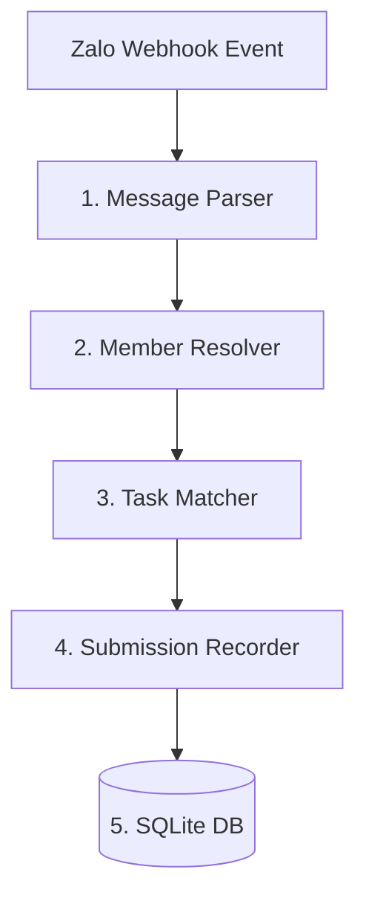

# Thiết kế Message Pipeline - VNV-Bot V2

Tài liệu này mô tả chi tiết kiến trúc luồng xử lý tin nhắn (Message Pipeline) của VNV-Bot V2. Luồng xử lý này đảm bảo mọi tin nhắn sự kiện từ Zalo gửi về Webhook được phân tích, định danh thành viên, ghép nối nhiệm vụ và ghi nhận kết quả tự động vào cơ sở dữ liệu một cách an toàn và tối ưu hiệu năng.

---

## Luồng Xử Lý Chi Tiết (Pipeline Stages)

### 1. Message Parser (Bộ phân tích Tin nhắn)
* **Nhiệm vụ:** Tiếp nhận payload JSON từ webhook Zalo, trích xuất dữ liệu thô và cấu trúc hóa dữ liệu tin nhắn.
* **Dữ liệu trích xuất:**
  * `zalo_msg_id`: ID duy nhất của tin nhắn trên Zalo.
  * `sender_id`: ID Zalo của người gửi.
  * `group_id`: ID của nhóm chat Zalo nơi tin nhắn được gửi đến.
  * `timestamp`: Thời điểm gửi tin nhắn.
  * `msg_type`: Loại tin nhắn (`text`, `image`, `sticker`, `attachment`, `link`).
  * `raw_content`: Nội dung văn bản thô hoặc URL của tệp tin/hình ảnh đính kèm.

### 2. Member Resolver (Bộ định danh Thành viên)
* **Nhiệm vụ:** Ánh xạ thông tin Zalo thô vào hệ thống tổ chức VNV dựa trên bảng ánh xạ thành viên (`members` và `regions`).
* **Quy trình xử lý:**
  1. Kiểm tra nhóm chat `group_id` có liên kết với vùng nào trong bảng `regions` hay không.
     * Nếu không thuộc vùng nào: Bỏ qua tin nhắn (hoặc ghi log debug).
  2. Tra cứu `sender_id` trong bảng `members` liên kết với `region_id` của nhóm chat đó.
  3. **Xử lý tài khoản chưa định danh:**
     * Nếu không tìm thấy `sender_id` trong bảng `members`: Đưa thành viên vào danh sách **"Tài khoản chưa xác minh"** trong phân vùng bộ nhớ tạm, ghi nhận log hệ thống và gửi thông báo nhắc nhở Trưởng Vùng cập nhật thông tin mapping thành viên. Không tự ý đoán tên hoặc gán trạng thái hoàn thành.

### 3. Task Matcher (Bộ ghép nối Nhiệm vụ)
* **Nhiệm vụ:** Đối chiếu tin nhắn với nhiệm vụ (Task) đang hoạt động trong ngày của VNV.
* **Quy trình xử lý:**
  1. Truy vấn cơ sở dữ liệu để tìm nhiệm vụ hoạt động trong ngày hiện tại (`publish_date = YYYY-MM-DD` và `status = 'active'`).
  2. Trường hợp đặc biệt (ví dụ: ngày đó có nhiều nhiệm vụ song song): Áp dụng phân tích từ khóa mở rộng hoặc mã nhiệm vụ (`task_code`) có trong nội dung tin nhắn để ghép chính xác tin nhắn của thành viên vào nhiệm vụ tương ứng.

### 4. Submission Recorder (Bộ ghi nhận Kết quả)
* **Nhiệm vụ:** Đánh giá tính hợp lệ của bài nộp dựa trên loại nhiệm vụ và lưu trữ kết quả.
* **Tiêu chuẩn chấm điểm tự động:**
  * **Nhiệm vụ Ảnh (Image Task):** Chỉ cần kiểm tra `msg_type === 'image'`. Trạng thái lưu: `approved`.
  * **Nhiệm vụ Từ khóa (Keyword Task):** Kiểm tra `raw_content` có chứa một trong các từ khóa quy định không phân biệt hoa thường (`DONE`, `OK`, `XONG`, `ĐÃ LÀM`). Trạng thái lưu: `approved`.
  * **Nhiệm vụ Link (Link Task):** Phải kiểm tra định dạng URL hợp lệ (ví dụ: liên kết facebook, youtube hoặc form báo cáo). Trạng thái lưu: `pending_review` (chờ Trưởng vùng duyệt).
  * **Nhiệm vụ Thủ công (Manual Task):** Trạng thái lưu: `pending_review`.
* **Tránh ghi đè trùng lặp:** Nếu sứ giả đã hoàn thành nhiệm vụ trong ngày (`status = 'approved'`), bỏ qua các tin nhắn nộp bài tiếp theo của sứ giả đó đối với nhiệm vụ này để tránh trùng lặp ghi nhận.

### 5. SQLite Storage (Ghi nhận Database)
* **Nhiệm vụ:** Ghi đè hoặc tạo mới bản ghi hoàn thành nhiệm vụ vào bảng `submissions` trong SQLite.
* **Đảm bảo tính đồng thuận dữ liệu (Concurrency):**
  * Sử dụng cơ chế ghi `WAL` (Write-Ahead Logging) để tránh chặn đọc khi đang ghi tin nhắn hàng loạt từ Webhook.
  * Thiết lập `busyTimeout = 5000ms` để hàng đợi ghi dữ liệu từ bot không bị xung đột với các phiên đọc dữ liệu báo cáo từ Dashboard của người dùng.
