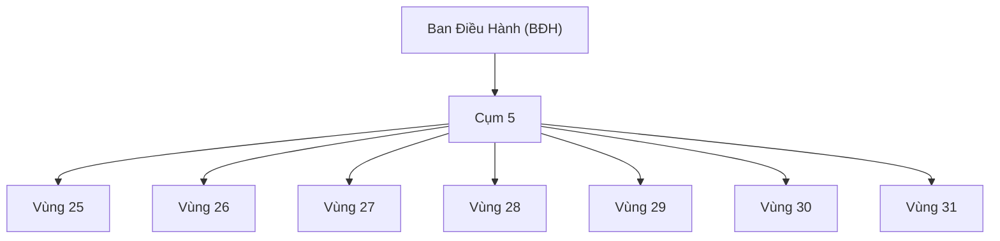

# PRODUCT REQUIREMENT DOCUMENT (PRD)
# VNV-BOT V2

- **Version:** 2.0
- **Owner:** Nguyễn Thuận An
- **Project Type:** Internal Volunteer Automation System
- **Date:** June 2026

---

## 1. PROJECT OVERVIEW

### 1.1 Background
VNV là hệ thống thiện nguyện hoạt động theo mô hình phân cấp hành chính nhằm kết nối và hỗ trợ các hoạt động tình nguyện trên toàn quốc. Sơ đồ phân cấp quản lý của VNV như sau:

$$\text{Ban Điều Hành (BĐH)} \rightarrow \text{Cụm} \rightarrow \text{Vùng} \rightarrow \text{Sứ Giả (SG)}$$

Hiện tại, việc theo dõi nhiệm vụ hàng ngày, tổng hợp kết quả và lập báo cáo từ cấp Vùng lên cấp Cụm và BĐH vẫn đang được thực hiện hoàn toàn thủ công. Quy trình này tiêu tốn nhiều thời gian của các Trưởng vùng, Trưởng cụm, đồng thời dễ phát sinh sai sót, nhầm lẫn dữ liệu hoặc chậm trễ tiến độ báo cáo.

VNV-Bot V2 được định hướng xây dựng để tự động hóa toàn bộ các khâu này, giải phóng sức lao động thủ công và đảm bảo dữ liệu báo cáo chính xác, cập nhật theo thời gian thực.

### 1.2 Core Objectives
- Tự động hóa việc nhận diện và chia sẻ nhiệm vụ hàng ngày từ nhóm điều hành về các nhóm vùng.
- Theo dõi trạng thái hoàn thành nhiệm vụ của từng Sứ giả mà không xâm phạm quyền riêng tư và không tải nặng tài nguyên hệ thống.
- Cập nhật tự động và đồng bộ hóa kết quả lên Google Sheet dùng chung.
- Tự động biên soạn báo cáo cấp Vùng và báo cáo cấp Cụm theo đúng định dạng (format) chuẩn của VNV.
- Gửi báo cáo tự động đến các nhóm chat Zalo tương ứng đúng khung giờ quy định.

---

## 2. BUSINESS GOALS

- **Goal 1 (Giảm giờ làm việc):** Giảm $90\%$ thời gian tổng hợp, đối soát và làm báo cáo của các Trưởng vùng và Trưởng cụm.
- **Goal 2 (Độ chính xác dữ liệu):** Giảm thiểu $100\%$ lỗi nhập liệu thủ công, trùng lặp thông tin hoặc bỏ sót Sứ giả đã hoàn thành.
- **Goal 3 (Chuẩn hóa báo cáo):** Tự động sinh báo cáo đúng cấu trúc, cách hành văn và định dạng chuẩn của tổ chức VNV.
- **Goal 4 (Trải nghiệm tối giản):** Không yêu cầu người dùng cuối (Sứ giả, Trưởng vùng, Trưởng cụm) phải cài đặt phần mềm phức tạp hay có kiến thức kỹ thuật. Tương tác hoàn toàn qua các nhóm chat Zalo hiện hữu và Google Sheet.

---

## 3. ORGANIZATION STRUCTURE

Cấu trúc phân cấp cụ thể áp dụng cho phiên bản VNV-Bot V2 này tập trung vào quản lý **Cụm 5** và các **Vùng** trực thuộc:

- **Tổng số Vùng quản lý trực tiếp:** 07 Vùng (từ Vùng 25 đến Vùng 31).
- **Mỗi Vùng** sẽ có danh sách các **Sứ giả** hoạt động độc lập và chịu sự quản lý của Trưởng vùng (Regional Leader).

---

## 4. USER ROLES

Hệ thống phân quyền chi tiết cho 3 đối tượng người dùng chính:

### 4.1 Regional Leader (Trưởng Vùng)
- **Phạm vi quản lý:** Giới hạn trong 01 Vùng duy nhất được chỉ định (ví dụ: Trưởng vùng 27 chỉ quản lý Vùng 27).
- **Quyền hạn hành động:**
  - Chạy thủ công hoặc cấu hình bot hoạt động riêng cho Vùng của mình.
  - Xem và quản lý dữ liệu của các Sứ giả thuộc Vùng mình quản lý.
  - Kích hoạt gửi báo cáo ngày của Vùng lên nhóm Cụm.
- **Giới hạn bảo mật (Constraints):**
  - Tuyệt đối không được xem hoặc can thiệp dữ liệu của các Vùng khác.
  - Không được xem báo cáo tổng hợp của Cụm.
  - Không được quyền truy cập hoặc gửi tin nhắn trong nhóm điều hành cấp cao của BĐH.

### 4.2 Cluster Leader (Trưởng Cụm)
- **Phạm vi quản lý:** Quản lý toàn bộ **Cụm 5** (bao gồm cả 07 Vùng trực thuộc).
- **Quyền hạn hành động:**
  - Xem dữ liệu chi tiết và tổng hợp của tất cả các Vùng (từ Vùng 25 đến Vùng 31).
  - Chạy hoặc kích hoạt bot cấp Cụm và kích hoạt bot cấp Vùng cho bất kỳ Vùng nào thuộc Cụm 5.
  - Xuất và gửi báo cáo tổng hợp cấp Cụm lên nhóm BĐH.
  - Có quyền truy cập, đọc và gửi tin nhắn trong nhóm BĐH.

### 4.3 System Admin (Quản trị hệ thống)
- **Phạm vi quản lý:** Toàn bộ hệ thống VNV-Bot V2.
- **Quyền hạn hành động:**
  - Quản lý toàn bộ cấu hình hệ thống, token kết nối (Zalo, Google Sheet API).
  - Quản lý bảng mapping thành viên (Member Mapping System).
  - Quản lý tài khoản, phân vai trò cho Trưởng vùng và Trưởng cụm.
  - Tra cứu log hệ thống, xử lý lỗi kỹ thuật phát sinh.

---

## 5. PERMISSION MATRIX

| Quyền hạn / Thao tác | Regional Leader | Cluster Leader | System Admin |
| :--- | :---: | :---: | :---: |
| **Đọc dữ liệu Vùng mình quản lý** | **YES** | **YES** | **YES** |
| **Đọc dữ liệu các Vùng khác** | NO | **YES** | **YES** |
| **Ghi/Sửa trạng thái hoàn thành của Vùng** | **YES** | **YES** | **YES** |
| **Kích hoạt/Sinh Báo cáo cấp Vùng** | **YES** | **YES** | **YES** |
| **Kích hoạt/Sinh Báo cáo tổng hợp cấp Cụm** | NO | **YES** | **YES** |
| **Gửi báo cáo vào nhóm BĐH** | NO | **YES** | **YES** |
| **Thay đổi phân vai trò & Mapping Sứ giả** | NO | NO | **YES** |
| **Thay đổi cấu hình hệ thống** | NO | NO | **YES** |

---

## 6. ZALO GROUP CONFIGURATION

Hệ thống Bot liên kết trực tiếp với các nhóm chat Zalo theo danh sách định danh bắt buộc dưới đây. Việc cấu hình đúng tên nhóm là điều kiện tiên quyết để Bot hoạt động chính xác.

### 6.1 Nhóm cấp Cụm (Cluster Group)
- **Tên hiển thị Zalo:** `CỤM 5`
- **Chức năng:** Là nơi nhận báo cáo hàng ngày của 7 Vùng gửi lên và là nơi Trưởng cụm theo dõi tổng thể.

### 6.2 Nhóm cấp Ban Điều Hành (BĐH Group)
- **Tên hiển thị Zalo:** `BĐH SỨ GIẢ TOÀN QUỐC - VNV`
- **Chức năng:** Nhóm nhận báo cáo tổng hợp cuối ngày của các Cụm gửi lên cho Ban Điều Hành.

### 6.3 Nhóm cấp Vùng (Regional Groups)
Gồm 07 nhóm tương ứng với 07 vùng trực thuộc:
- `Vùng 25`
- `Vùng 26`
- `Vùng 27`
- `Vùng 28`
- `Vùng 29`
- `Vùng 30`
- `Vùng 31`
- **Chức năng:** Nơi Bot chia sẻ nhiệm vụ hàng ngày và lắng nghe báo cáo hoàn thành (tin nhắn/ảnh) từ các Sứ giả.

---

## 7. MEMBER MAPPING SYSTEM

Để nhận diện chính xác Sứ giả và Trưởng vùng trên Zalo mà không phụ thuộc vào việc thay đổi tên hiển thị (Display Name) tùy tiện của người dùng, hệ thống phải duy trì một bảng Mapping Thành viên tập trung.

### 7.1 Cấu trúc bảng Mapping dữ liệu
Mỗi thành viên (Sứ giả, Leader) trong hệ thống được định nghĩa bởi các trường thông tin sau:
- **ID:** Mã số định danh duy nhất (ví dụ: `001`, `002`).
- **Tên thật:** Họ và tên khai sinh của thành viên.
- **Tên Zalo:** Tên tài khoản Zalo hoặc Zalo User ID (để bot mapping chính xác khi nhận event).
- **Vùng:** Số vùng trực thuộc (từ 25 đến 31).
- **Vai trò:** Vai trò trong tổ chức (`Trưởng cụm`, `Trưởng vùng`, `Sứ giả`).
- **Trạng thái:** Tình trạng hoạt động (`Active` - đang hoạt động, `Inactive` - đã nghỉ).

*Ví dụ bản ghi mapping:*

| ID | Tên thật | Tên Zalo | Vùng | Vai trò | Trạng thái |
| :--- | :--- | :--- | :---: | :--- | :---: |
| 001 | Nguyễn Thị Thanh Trà | Thanh Trà | 27 | Sứ giả | Active |
| 002 | Phạm Minh Tú | Tú Phạm | 5 | Trưởng cụm | Active |

---

## 8. DAILY TASK DISTRIBUTION

Quy trình tự động hóa việc phát hiện và chia sẻ nhiệm vụ ngày của VNV:

- **Khung giờ chạy tự động:** Từ `10h00` đến `15h00` hàng ngày.
- **Nguồn giám sát (Sources):** Bot liên tục theo dõi tin nhắn mới tại 2 nhóm nguồn:
  1. `CỤM 5`
  2. `TỔNG BĐH KÊNH SỨ GIẢ - VNV` (Nhóm thông tin nguồn từ BĐH)
- **Hành động phát hiện nhiệm vụ:** 
  - Khi xuất hiện tin nhắn chứa nội dung nhiệm vụ mới (được định nghĩa bằng các mẫu tin nhắn hướng dẫn công việc hoặc thông báo chung của BĐH).
- **Quy trình phân phối (Distribution):**
  - Sao chép nguyên văn nội dung tin nhắn nhiệm vụ đó (bao gồm cả định dạng text, link nếu có).
  - Tự động chuyển tiếp (forward) hoặc gửi mới nội dung này đồng loạt đến 07 nhóm Vùng (`Vùng 25` đến `Vùng 31`).

---

## 9. TASK COMPLETION DETECTION

Đây là phần nghiệp vụ cốt lõi và nhạy cảm nhất của hệ thống VNV-Bot V2. Để khắc phục triệt để lỗi vận hành ở phiên bản V1, thuật toán nhận diện hoàn thành phải tuân thủ nghiêm ngặt các nguyên tắc sau:

### 9.1 Nguyên tắc thiết kế kỹ thuật (BẮT BUỘC)
> [!IMPORTANT]
> **KHÔNG SỬ DỤNG CÁC CƠ CHẾ SAU (NGUYÊN NHÂN THẤT BẠI CỦA V1):**
> 1. Không dùng tính năng tìm kiếm ngày trên thanh tìm kiếm của ứng dụng Zalo.
> 2. Không quét lịch sử chat của nhóm theo ngày (quét lùi thời gian).
> 3. Không scroll ngược/cuộn trang ngược dòng thời gian nhiều ngày để tìm tin nhắn cũ.
> 
> **MÔ HÌNH THAY THẾ:**
> Hệ thống phải chuyển dịch hoàn toàn sang mô hình **Event Tracking** (Lắng nghe sự kiện thời gian thực thông qua Webhook/Zalo API) phối hợp chặt chẽ với **State Management** (Quản lý và lưu trữ trạng thái hoàn thành trong ngày vào Database độc lập của Bot).

- **Event Tracking:** Mọi tin nhắn hoặc hình ảnh gửi vào các nhóm Vùng sẽ được Bot bắt và xử lý ngay lập tức (Real-time Event).
- **State Management:** Khi nhận được event từ một Sứ giả, Bot phân tích nội dung và cập nhật trạng thái hoàn thành vào cơ sở dữ liệu cho ngày hiện tại. Cuối ngày, việc sinh báo cáo chỉ việc truy vấn từ Database trạng thái này, tuyệt đối không được quét ngược lại Zalo.

### 9.2 Nguyên tắc xử lý nội dung (Không phức tạp hóa)
- **Không sử dụng công nghệ OCR** (nhận diện chữ trên ảnh).
- **Không dùng AI** để đọc hiểu hình ảnh.
- Bot chỉ tập trung xác định **Danh tính người gửi** (thông qua Mapping Zalo ID) và **Loại tin nhắn/Từ khóa**.

### 9.3 Điều kiện ghi nhận Sứ giả hoàn thành nhiệm vụ trong ngày
Một Sứ giả được xác nhận trạng thái **DONE (Hoàn thành)** khi đáp ứng một trong hai điều kiện sau trong ngày:
1. **Có gửi ảnh** gửi vào nhóm Vùng (không cần biết nội dung ảnh là gì).
2. **Có gửi tin nhắn** chứa một trong các từ khóa không phân biệt hoa thường sau:
   - `DONE`
   - `OK`
   - `XONG`
   - `ĐÃ LÀM`

---

## 10. GOOGLE SHEET SYNCHRONIZATION

Hệ thống đồng bộ hóa trạng thái hoàn thành của Sứ giả lên Google Sheet tổng dùng chung để các bên liên quan có thể kiểm tra trực quan.

- **Phương thức kết nối:** Sử dụng Google Sheets API (xác thực qua Service Account).
- **Quy tắc cập nhật ô dữ liệu (Cell Update Rules):**
  - **Trường hợp Hoàn thành:** Ghi nội dung `OK` vào ô tương ứng với ngày hiện tại của Sứ giả đó.
  - **Trường hợp Chưa hoàn thành (mặc định cuối ngày):** Để trống (`blank`).
  - **Trường hợp Trưởng vùng/Trưởng cụm đánh dấu thủ công:** Nếu có cập nhật lý do đặc biệt (ví dụ: `SG ko phản hồi`, `SG ốm`, `Chưa có thiết bị`), Bot phải ghi nhận đúng nguyên văn nội dung ghi chú đó vào ô dữ liệu trên Google Sheet.

---

## 11. REGION REPORT GENERATION

- **Khung giờ tự động tổng hợp & sinh báo cáo:** Từ `21h00` đến `22h30` hàng ngày.
- **Nguồn dữ liệu:** Đọc từ cơ sở dữ liệu State Management của ngày hiện tại (không quét Zalo).
- **Các chỉ số bắt buộc trong Báo cáo Vùng:**
  - Tổng số Sứ giả thuộc Vùng.
  - Số lượng Sứ giả đã hoàn thành nhiệm vụ.
  - Số lượng Sứ giả chưa hoàn thành nhiệm vụ.
  - Danh sách Sứ giả chưa hoàn thành kèm theo lý do (nếu có ghi chú).
  - Phần thông tin bổ sung/phát sinh trong ngày (nếu Trưởng vùng điền thêm).
- **Định dạng đầu ra:** Xuất ra nội dung văn bản (Plain text/Markdown) theo đúng định dạng báo cáo chuẩn VNV truyền thống.

---

## 12. CLUSTER REPORT GENERATION

- **Khung giờ tự động tổng hợp & sinh báo cáo:** Từ `22h15` đến `23h00` hàng ngày.
- **Nguồn dữ liệu:** Tổng hợp từ dữ liệu trạng thái của **07 báo cáo Vùng** trực thuộc Cụm 5.
- **Các chỉ số bắt buộc trong Báo cáo Cụm:**
  - Tổng số thành viên toàn Cụm.
  - Tổng số Sứ giả đã hoàn thành trên toàn Cụm.
  - Tổng số Sứ giả chưa hoàn thành.
  - Ghi chú/Tình hình chi tiết của từng Vùng (Vùng 25 -> Vùng 31).
  - Các thông tin bổ sung, đề xuất cấp Cụm.
- **Định dạng đầu ra:** Xuất ra văn bản theo đúng định dạng báo cáo chuẩn cấp Cụm của VNV.

---

## 13. AUTO SEND REPORT

Cơ chế tự động gửi tin nhắn báo cáo sau khi đã được sinh và kiểm tra:

### 13.1 Gửi Báo cáo Vùng (Region Mode)
- **Nơi nhận báo cáo:** 
  1. Nhóm Zalo của chính Vùng đó (để Sứ giả đối soát).
  2. Nhóm Zalo `CỤM 5` (để Trưởng cụm theo dõi).

### 13.2 Gửi Báo cáo Cụm (Cluster Mode)
- **Nơi nhận báo cáo:** Nhóm Zalo `BĐH SỨ GIẢ TOÀN QUỐC - VNV`.
- **Yêu cầu bắt buộc:** Phải gắn thẻ (tag) tài khoản của điều phối viên BĐH: `@Phạm Minh Tú` để thông báo nghiệm thu báo cáo.

---

## 14. ERROR HANDLING

Hệ thống cần thiết lập cơ chế xử lý lỗi chặt chẽ, không tự ý đưa ra giả định khi dữ liệu không rõ ràng:

- **Lỗi không tìm thấy group chat Zalo:** Nếu không kết nối được hoặc nhóm bị đổi tên không khớp cấu hình, Bot phải ghi nhận lỗi vào log và gửi cảnh báo khẩn cấp cho System Admin.
- **Lỗi Sứ giả không khớp Mapping:** Nếu một người dùng Zalo không có tên trong bảng Mapping gửi tin nhắn/ảnh vào nhóm Vùng, Bot phải:
  - Ghi nhận tài khoản này vào một danh sách riêng: **"Danh sách tài khoản cần xác minh"**.
  - Không tự động gán tên hoặc đoán danh tính của Sứ giả.
  - Gửi thông báo nhắc nhở Trưởng vùng cập nhật thông tin mapping cho thành viên mới này.

---

## 15. LOGGING

Bot phải ghi nhận và lưu trữ nhật ký hoạt động chi tiết phục vụ mục đích kiểm toán và đối soát:

- **Thông tin cần lưu trong Log:**
  - Mốc thời gian chạy cụ thể (Timestamp).
  - Định danh người dùng kích hoạt lệnh/gửi tin nhắn (User ID).
  - Tên nhóm chat Bot đã truy cập/gửi tin (Group Name/ID).
  - Số lượng Sứ giả đã hoàn thành được ghi nhận tại thời điểm log.
  - Chi tiết các lỗi phát sinh (nếu có).
- **Thời gian lưu trữ tối thiểu:** **90 ngày** kể từ thời điểm phát sinh log.

---

## 16. FUTURE VERSION ROADMAP

Định hướng phát triển các phiên bản tiếp theo sau khi V2.0 hoạt động ổn định:

- **Version 2.1 (Dashboard Web):** Xây dựng giao diện web quản trị trực quan giúp System Admin và Trưởng cụm dễ dàng chỉnh sửa bảng Mapping, cấu hình giờ chạy và xem biểu đồ hoàn thành trực tuyến.
- **Version 2.2 (Telegram Notification):** Tích hợp kênh thông báo qua Telegram của Ban Quản Trị để đẩy nhanh các cảnh báo lỗi hệ thống hoặc báo cáo khẩn cấp.
- **Version 2.3 (AI Anomaly Detection):** Áp dụng AI/Machine Learning để phát hiện các báo cáo bất thường (ví dụ: một Sứ giả liên tục báo DONE trong thời gian quá ngắn hoặc gửi ảnh sai lệch mục tiêu nghiêm trọng).

---

## 17. SUCCESS CRITERIA

Dự án VNV-Bot V2 chỉ được nghiệm thu khi đạt toàn bộ các chỉ số hiệu năng (KPIs) sau:

- **Tỷ lệ nhận diện đúng trạng thái hoàn thành:** $\ge 95\%$ (không bỏ sót ảnh hoặc từ khóa hợp lệ của Sứ giả trong ngày).
- **Tỷ lệ sinh báo cáo đúng định dạng:** $\ge 99\%$ (báo cáo xuất ra không bị lỗi ký tự, đúng mẫu và đúng cấu trúc VNV yêu cầu).
- **Thời gian tạo báo cáo cấp Vùng:** $< 30 \text{ giây}$ kể từ lúc kích hoạt hoặc đến giờ hẹn.
- **Thời gian xử lý tổng hợp báo cáo cấp Cụm:** $< 2 \text{ phút}$ (bao gồm cả việc gom dữ liệu từ 7 vùng và tạo báo cáo tổng).

---
**END OF PRD_VNV_BOT_V2**
