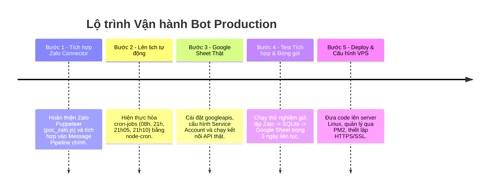

# Kiểm Toán Hệ Thống Giai Đoạn 2 (System Audit Phase 2) - VNV-Bot V2

Tài liệu này đánh giá khoảng cách giữa giao diện Web Dashboard quản trị hiện tại và các module cốt lõi cần có để bot Zalo vận hành thực tế ngoài môi trường Production.

---

## 1. Những gì đã hoàn thành (Completed Modules)
* **Cơ sở Dữ liệu & Ràng buộc:** SQLite Database Schema hoàn chỉnh, có các ràng buộc UNIQUE chặt chẽ cho `sheet_id`, `manager_id`, ràng buộc khóa ngoại `ON DELETE SET NULL`, và cơ chế ghi log lịch sử (`audit_logs`).
* **SQLite WAL & Concurrency:** Bật chế độ WAL (`journal_mode=WAL`) và `busyTimeout=5000` giúp bot ghi dữ liệu đồng thời từ Zalo mà không gây lỗi khóa cơ sở dữ liệu khi người dùng truy cập Web Dashboard.
* **Hệ thống API & Phân quyền (RBAC):** Hoàn thành toàn bộ API CRUD và phân quyền phạm vi dữ liệu cấp hàng (Row-Level Security) cho Admin, Trưởng Cụm (Cluster Leader), và Trưởng Vùng (Region Leader).
* **Giao diện Quản trị (Dashboard Web GUI):** Web GUI mượt mà (Glassmorphism Dark UI), đầy đủ chức năng quản trị tài khoản, quản lý cụm, quản lý vùng và đối soát báo cáo. Đã xử lý triệt để nguy cơ tấn công XSS (DOM XSS & Attribute XSS).
* **Kiểm thử RBAC tự động:** Tệp [rbac_test.js](file:///d:/Project/vnv_bot/src/tests/rbac_test.js) tự động mô phỏng và kiểm tra chính xác các quyền hạn truy xuất và đồng bộ của từng vai trò.

---

## 2. Các Module còn thiếu để Bot vận hành thực tế trên Zalo
* **Zalo API Connector & Token Manager (Module OA API):**
  * Zalo OA API yêu cầu cấu hình Access Token (hết hạn sau 25 giờ) và Refresh Token. Hệ thống hiện chưa có cơ chế tự động refresh token Zalo định kỳ và cập nhật vào cấu hình cục bộ (`local_config`).
  * Cần viết thêm module quản lý và lưu trữ token Zalo tự động.
* **Tích hợp Zalo Puppeteer Connector (Quét nhóm cộng đồng):**
  * Zalo OA API có giới hạn nghiêm ngặt, không thể tự do tương tác trong các nhóm chat cá nhân/cộng đồng nếu không có sự phê duyệt đặc biệt.
  * Dự án có viết file kiểm nghiệm `poc_zalo.js` dùng Puppeteer để giả lập trình duyệt, quét tin nhắn nhóm. Tuy nhiên, module này chưa được tích hợp vào API chính thức của Backend để tự động đẩy tin nhắn vào **Message Pipeline**.
* **Cấu hình Google Sheets API thật:**
  * Thư viện `googleapis` chưa được bổ sung vào `package.json` và chưa chạy cài đặt thực tế (`npm install googleapis`).
  * File `data/credentials.json` (chứa khóa bí mật của Service Account) mới ở dạng giả lập (mock). Cần đăng ký Google Cloud Console, tạo Service Account và chia sẻ quyền Editor cho tài khoản email này trên các Google Sheet Vùng.
* **Scheduler định thời tự động:**
  * Hiện tại Scheduler mới ở mức thiết kế lý thuyết trong [SCHEDULER_DESIGN_V1.md](file:///d:/Project/vnv_bot/SCHEDULER_DESIGN_V1.md). Chưa viết code thực tế khởi tạo `node-cron` chạy ngầm trong `src/index.js`.

---

## 3. Ước lượng % Hoàn thành Toàn dự án
Hệ thống hiện tại đạt khoảng **$55\%$ - $60\%$** tổng khối lượng công việc của một giải pháp hoàn chỉnh:
* **Giao diện Dashboard, API Backend, Phân quyền & DB:** Hoàn thành **$95\%$**.
* **Nhận diện và Chấm điểm Nhiệm vụ (Submission Engine):** Hoàn thành **$80\%$** (đã viết logic, cần kết nối cổng nhận tin nhắn).
* **Kết nối vận hành Zalo (OA Webhook, Puppeteer, Token Auto-refresh):** Hoàn thành **$15\%$** (mới có file POC độc lập).
* **Hệ thống Định thời (Scheduler) & Google Sheet thật:** Hoàn thành **$20\%$** (đã thiết kế luồng và viết code mock).

---

## 4. Kế hoạch triển khai Google Sheet Production Ready

Để đưa module Google Sheet vào hoạt động thực tế không lỗi, cần thực hiện theo các bước sau:

1. **Cài đặt thư viện Google API:**
   Chạy lệnh `npm install googleapis` để cài đặt thư viện chính thức từ Google.
2. **Thiết lập Service Account trên Google Cloud Console:**
   * Truy cập Google Cloud Console, tạo một Project mới.
   * Kích hoạt **Google Sheets API**.
   * Vào mục **IAM & Admin > Service Accounts**, tạo tài khoản dịch vụ và tải về tệp JSON khóa bí mật (private key).
   * Lưu tệp JSON này vào thư mục dự án: `data/credentials.json`.
3. **Cấp quyền truy cập Google Sheet:**
   * Mở các file Google Sheet dùng chung của từng Vùng.
   * Nhấn **Share (Chia sẻ)**, thêm email của Service Account (dạng `xxx@xxx.iam.gserviceaccount.com`) làm người chỉnh sửa (**Editor**).
4. **Cấu hình trong Trang Quản trị:**
   * Lấy mã ID của Google Sheet từ URL (ví dụ: `1BxiMVs0XRA5nFMdKvBdBZjX9JuNhXS95213...`).
   * Điền mã ID, URL và tên Trang tính tương ứng vào cấu hình của từng Vùng trên trang Dashboard quản trị.

---

## 5. Lộ trình Triển khai đến Phiên bản Production (Roadmap)

