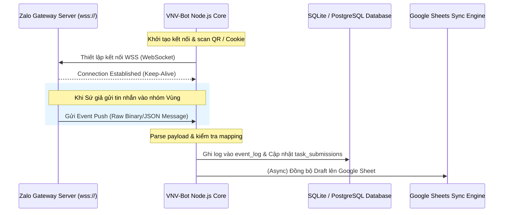
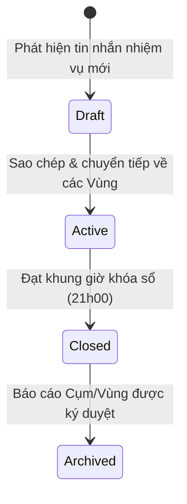
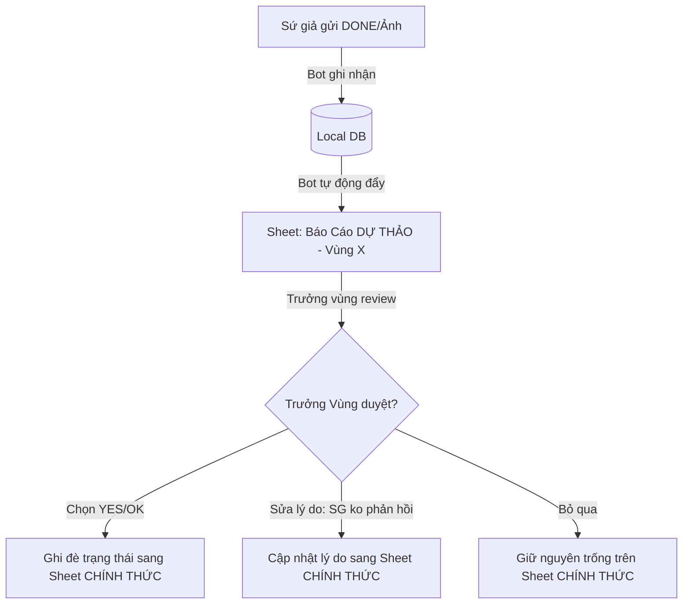
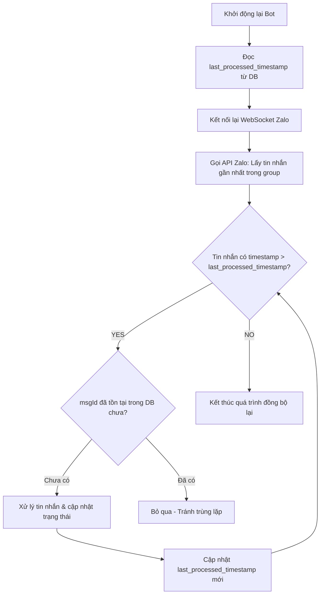
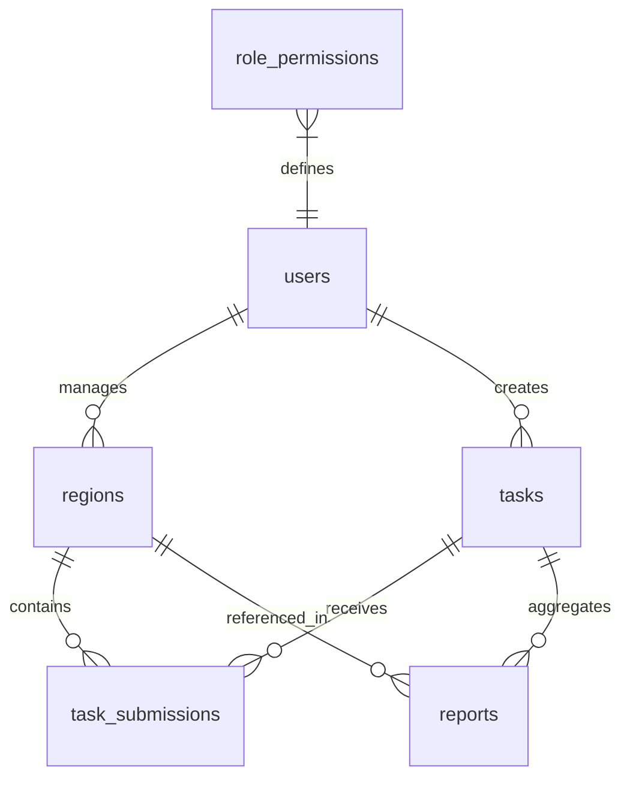

# SYSTEM DESIGN DOCUMENT
# VNV-BOT V2 - ARCHITECTURE & SPECIFICATIONS

- **Version:** 1.0 (Draft)
- **Status:** Pending Review
- **Owner:** Nguyễn Thuận An
- **Project:** VNV-Bot v2 System Design

---

## 1. ZALO EVENT SOURCE DETAILED SPECIFICATION

Để loại bỏ hoàn toàn cơ chế tìm kiếm cũ (quét lùi lịch sử chat hoặc scroll ngược), VNV-Bot V2 chuyển sang mô hình **Event-Driven Architecture (Kiến trúc hướng sự kiện)**. Dưới đây là phương án kỹ thuật thực tế để lắng nghe và bắt sự kiện thời gian thực từ Zalo Groups.

### 1.1 Kỹ thuật lắng nghe Event Zalo: WebSocket Protocol Simulation (Self-Bot / Client API)
Do Zalo Group không hỗ trợ Official Account (OA) thông thường một cách linh hoạt cho người dùng cá nhân/tổ chức phi lợi nhuận nhỏ, hệ thống sẽ sử dụng cơ chế giả lập kết nối Zalo Web Client.



#### Quy trình thực hiện chi tiết:
1. **Duy trì kết nối WebSocket:**
   - Bot chạy một Node.js process sử dụng thư viện mô phỏng giao thức Zalo Web (ví dụ: wrapper dựa trên Zalo Web WebSocket Protocol).
   - Thiết lập kết nối liên tục đến Gateway WebSocket của Zalo (`wss://wpa.zalo.me/...` hoặc các endpoint tương đương).
   - Xác thực thông qua Session Cookie (`zpw_sek`, `zpw_ver`) được trích xuất sau khi quét mã QR hoặc đăng nhập lần đầu. Hệ thống tích hợp cơ chế Auto-Refresh Session để duy trì trạng thái đăng nhập.

2. **Cấu trúc dữ liệu Event nhận về (Raw WebSocket Payload):**
   Mỗi khi có tin nhắn mới trong bất kỳ group nào mà tài khoản Bot tham gia, Zalo Gateway sẽ đẩy một event dạng JSON về client. Bot sẽ filter để chỉ lấy các event thuộc loại `3` (Nhóm - Group Message).

   ```json
   {
     "event_type": "group_message",
     "data": {
       "msgId": 17495461573021111,
       "groupId": "18923456789012345",
       "groupName": "Vùng 27",
       "fromUid": "9023456789123456",
       "fromName": "Thanh Trà",
       "msgType": "photo", 
       "content": "Description / Caption of the photo",
       "attachments": [
         {
           "id": "photo_id_123",
           "thumbUrl": "https://..."
         }
       ],
       "timestamp": 1749546157302
     }
   }
   ```
   - **`msgType` = `text`**: Phân tích nội dung text trong `content` để khớp các từ khóa (`DONE`, `OK`, `XONG`, `ĐÃ LÀM`).
   - **`msgType` = `photo`**: Ghi nhận hoàn thành trực tiếp (chỉ cần Sứ giả gửi ảnh, không quét OCR hay AI).

### 1.2 Phương án dự phòng: DOM MutationObserver (Puppeteer/Playwright Headless Browser)
Trong trường hợp Zalo cập nhật giao thức WebSocket chặn các client bên thứ ba, Bot sẽ chuyển sang chế độ Headless Browser:
- Khởi chạy Chromium thông qua Puppeteer, đăng nhập vào `https://chat.zalo.me`.
- Sử dụng **DOM MutationObserver** tiêm (inject) vào container hiển thị tin nhắn của nhóm chat:
  ```javascript
  const observer = new MutationObserver((mutations) => {
    for (let mutation of mutations) {
      if (mutation.addedNodes.length > 0) {
        mutation.addedNodes.forEach(node => {
          // Trích xuất Sender ID, Message Type, Message Content
          // Gửi dữ liệu này về Backend Node.js thông qua window.exposedFunction
        });
      }
    }
  });
  observer.observe(document.querySelector('#chat-box-message-list'), { childList: true });
  ```
- **Tuyệt đối không dùng thao tác scroll hay tìm kiếm.** Observer lắng nghe thời gian thực, khi phần tử DOM mới được thêm vào, Bot lập tức chụp lại thông tin và lưu vào DB.

---

## 2. TASK IDENTITY DESIGN (THIẾT KẾ ĐỊNH DANH NHIỆM VỤ)

Để theo dõi độc lập các nhiệm vụ, không gắn cố định trạng thái hoàn thành với ngày (tránh trường hợp một ngày có nhiều nhiệm vụ hoặc nhiệm vụ kéo dài qua ngày hôm sau), hệ thống thiết kế cấu trúc Định danh Nhiệm vụ như sau:

### 2.1 Cấu trúc Task ID
Task ID được tạo tự động khi Bot phát hiện nhiệm vụ mới trên nhóm `CỤM 5` hoặc `TỔNG BĐH KÊNH SỨ GIẢ - VNV`:

$$\text{Task ID} = \text{TSK} - \text{YYYYMMDD} - \text{HASH}$$

- **`TSK`:** Tiền tố cố định (Prefix).
- **`YYYYMMDD`:** Ngày phát hiện nhiệm vụ (ví dụ: `20260618`).
- **`HASH`:** Chuỗi 4 ký tự hexa được tạo ra bằng cách băm (MD5/SHA256) nội dung text của nhiệm vụ. Chuỗi này đảm bảo tính độc nhất nếu trong một ngày phát sinh nhiều nhiệm vụ khác nhau.
- **Ví dụ:** `TSK-20260618-9F8A`

### 2.2 Sơ đồ trạng thái Nhiệm vụ (Task Lifecycle)



- **Active Task:** Tại một thời điểm, mỗi Vùng chỉ có **tối đa 1 nhiệm vụ** ở trạng thái `Active`.
- **Áp đặt submit:** Khi Sứ giả gửi ảnh hoặc nhắn từ khóa hoàn thành (`DONE`, `OK`), Bot tự động lấy `Task ID` đang `Active` của Vùng đó để ghi nhận vào bảng `task_submissions`.

---

## 3. MANUAL REVIEW LAYER DESIGN (CƠ CHẾ PHÊ DUYỆT BÁO CÁO)

Nhằm đảm bảo dữ liệu trên Google Sheet chính thức luôn chính xác và có sự kiểm soát của con người trước khi xuất bản, hệ thống thiết kế cơ chế Duyệt 2 lớp (Draft vs. Official).

### 3.1 Quy trình phê duyệt bằng Google Sheet Draft Webhook (Khuyên dùng)
Trưởng vùng sẽ tương tác trực tiếp trên giao diện bảng tính quen thuộc để phê duyệt trước khi ghi vào bảng điểm chính thức.



#### Chi tiết triển khai kỹ thuật:
1. **Đồng bộ bảng dự thảo (Draft Sheet):**
   - Hàng giờ, Bot cập nhật kết quả tự động quét được lên một Sheet phụ có tên `DRAFT_VUNG_XX`.
   - Các cột trong Sheet Draft: `Tên Sứ Giả`, `Trạng thái Bot quét`, `Trưởng vùng xác nhận (Dropdown)`, `Ghi chú`.
   - Cột `Trưởng vùng xác nhận` mặc định hiển thị giá trị Bot quét được (ví dụ: `OK`).

2. **Duyệt qua Google Apps Script Webhook:**
   - Cài đặt một script `onEdit` trên Google Sheet. Khi Trưởng vùng thay đổi cột `Trưởng vùng xác nhận` hoặc tick chọn ô `Duyệt toàn bộ`:
     ```javascript
     function onEdit(e) {
       var sheet = e.source.getActiveSheet();
       if (sheet.getName().startsWith("DRAFT_VUNG_") && e.range.getColumn() === 3) { // Cột xác nhận
         var payload = {
           "region": sheet.getName().replace("DRAFT_VUNG_", ""),
           "row": e.range.getRow(),
           "messenger_name": sheet.getRange(e.range.getRow(), 1).getValue(),
           "new_status": e.value
         };
         UrlFetchApp.fetch("https://vnv-bot-backend/api/webhook/review", {
           "method": "post",
           "contentType": "application/json",
           "payload": JSON.stringify(payload)
         });
       }
     }
     ```
   - API của Bot nhận webhook này, cập nhật trường `status` của submission trong local database sang `approved` hoặc `edited`, sau đó ghi đè giá trị chính xác sang Sheet báo cáo chính thức.

---

## 4. RECOVERY STRATEGY (CHIẾN LƯỢC PHỤC HỒI KHI CRASH/RESTART)

Hệ thống phải đảm bảo tính liên tục của dữ liệu (Resilience) trong trường hợp mất điện, restart server hoặc sự cố mạng mà không được quét lại Zalo bằng scroll ngược.

### 4.1 Cơ chế Đánh dấu Chuỗi Sự kiện (Sequence Timestamp Marker)
- Mỗi event nhận về từ Zalo luôn đi kèm một định danh duy nhất `msgId` và mốc thời gian `timestamp` (miliseconds).
- Trong Database local, hệ thống duy trì một bảng cấu hình key-value lưu trữ: `last_processed_timestamp`.
- Mỗi khi xử lý thành công một sự kiện (ghi DB thành công), hệ thống cập nhật:
  
  $$\text{last\_processed\_timestamp} = \text{max}(\text{last\_processed\_timestamp}, \text{event.timestamp})$$

### 4.2 Lưu đồ Xử lý Khởi động lại (Re-sync Window Flow)



- **Giới hạn Resync:** Zalo Web API hỗ trợ lấy lịch sử tin nhắn của một group trong phạm vi ngắn (ví dụ: 100 tin nhắn gần nhất). Do Bot lắng nghe liên tục, khoảng thời gian crash thường ngắn (< 15 phút), lượng tin nhắn trễ nằm hoàn toàn trong phạm vi cache này.
- **Tính lũy đẳng (Idempotency):** Khóa UNIQUE constraint trên cột `zalo_msg_id` trong database đảm bảo dù tin nhắn có bị quét lại do trễ mạng cũng không thể nhân đôi bản ghi hoàn thành của Sứ giả.

---

## 5. DATABASE SCHEMA DESIGN

Cơ sở dữ liệu sử dụng mô hình quan hệ (RDBMS) như SQLite (cho triển khai nhẹ tại local) hoặc PostgreSQL (cho môi trường production). Dưới đây là định nghĩa chi tiết các bảng:



### 5.1 Bảng `users`
Lưu trữ thông tin tài khoản người dùng đăng nhập hệ thống (System Admin, Cluster Leader, Regional Leader).

| Column Name | Data Type | Constraints | Description |
| :--- | :--- | :--- | :--- |
| `id` | INTEGER | PRIMARY KEY AUTOINCREMENT | Khóa chính |
| `username` | VARCHAR(50) | UNIQUE, NOT NULL | Tên đăng nhập |
| `password_hash` | VARCHAR(255) | NOT NULL | Mật khẩu băm (bcrypt) |
| `full_name` | VARCHAR(100) | NOT NULL | Họ tên thật |
| `zalo_id` | VARCHAR(50) | UNIQUE | ID tài khoản Zalo cá nhân |
| `role` | VARCHAR(20) | NOT NULL | Vai trò: `admin`, `cluster_leader`, `region_leader` |
| `status` | VARCHAR(20) | DEFAULT 'active' | Trạng thái: `active`, `inactive` |
| `created_at` | TIMESTAMP | DEFAULT CURRENT_TIMESTAMP | Ngày tạo tài khoản |
| `updated_at` | TIMESTAMP | DEFAULT CURRENT_TIMESTAMP | Ngày cập nhật |

### 5.2 Bảng `regions`
Danh mục các Vùng và mapping với Cụm cùng người quản lý trực tiếp.

| Column Name | Data Type | Constraints | Description |
| :--- | :--- | :--- | :--- |
| `id` | INTEGER | PRIMARY KEY AUTOINCREMENT | Khóa chính |
| `region_name` | VARCHAR(50) | UNIQUE, NOT NULL | Tên Vùng (ví dụ: `Vùng 27`) |
| `cluster_name` | VARCHAR(50) | NOT NULL | Tên Cụm quản lý (ví dụ: `Cụm 5`) |
| `zalo_group_id` | VARCHAR(50) | UNIQUE, NOT NULL | ID nhóm chat Zalo của Vùng |
| `manager_id` | INTEGER | FOREIGN KEY REFERENCES `users(id)` | Trưởng vùng quản lý |
| `created_at` | TIMESTAMP | DEFAULT CURRENT_TIMESTAMP | Ngày cấu hình vùng |

### 5.3 Bảng `tasks`
Lưu trữ thông tin chi tiết về các nhiệm vụ ngày được phân phối.

| Column Name | Data Type | Constraints | Description |
| :--- | :--- | :--- | :--- |
| `id` | INTEGER | PRIMARY KEY AUTOINCREMENT | Khóa chính |
| `task_code` | VARCHAR(50) | UNIQUE, NOT NULL | Mã ID nhiệm vụ (ví dụ: `TSK-20260618-9F8A`) |
| `zalo_source_msg_id` | VARCHAR(50) | UNIQUE, NOT NULL | ID tin nhắn gốc từ nhóm BĐH |
| `title` | VARCHAR(255) | | Tiêu đề tóm tắt nhiệm vụ |
| `description` | TEXT | NOT NULL | Nội dung chi tiết nhiệm vụ |
| `publish_date` | DATE | NOT NULL | Ngày phát sinh nhiệm vụ |
| `status` | VARCHAR(20) | DEFAULT 'active' | Trạng thái: `active` (đang làm), `closed` (đã khóa) |
| `created_by` | INTEGER | FOREIGN KEY REFERENCES `users(id)` | User ID của bot hoặc admin tạo |
| `created_at` | TIMESTAMP | DEFAULT CURRENT_TIMESTAMP | Thời gian phát hiện |

### 5.4 Bảng `task_submissions`
Lưu trữ chi tiết kết quả nộp bài, báo cáo hoàn thành của Sứ giả.

| Column Name | Data Type | Constraints | Description |
| :--- | :--- | :--- | :--- |
| `id` | INTEGER | PRIMARY KEY AUTOINCREMENT | Khóa chính |
| `task_id` | INTEGER | FOREIGN KEY REFERENCES `tasks(id)` | Liên kết tới Nhiệm vụ |
| `sender_zalo_id` | VARCHAR(50) | NOT NULL | Zalo ID của Sứ giả nộp bài |
| `sender_name` | VARCHAR(100) | NOT NULL | Tên hiển thị Zalo lúc gửi bài |
| `region_id` | INTEGER | FOREIGN KEY REFERENCES `regions(id)` | Thuộc Vùng nào |
| `zalo_msg_id` | VARCHAR(50) | UNIQUE, NOT NULL | ID tin nhắn nộp bài trên Zalo (Tránh duplicate) |
| `submission_type` | VARCHAR(20) | NOT NULL | Thể loại hoàn thành: `image`, `keyword`, `manual` |
| `raw_content` | TEXT | | Nội dung text hoặc link ảnh đính kèm |
| `status` | VARCHAR(20) | DEFAULT 'pending_review' | Trạng thái duyệt: `pending_review`, `approved`, `rejected` |
| `notes` | VARCHAR(255) | | Ghi chú lý do (ví dụ: `SG ko phản hồi`) |
| `submitted_at` | TIMESTAMP | DEFAULT CURRENT_TIMESTAMP | Thời điểm Sứ giả gửi tin nhắn |
| `processed_at` | TIMESTAMP | | Thời điểm Bot hoặc Leader duyệt |

### 5.5 Bảng `reports`
Lưu trữ thông tin báo cáo đã sinh và gửi đi.

| Column Name | Data Type | Constraints | Description |
| :--- | :--- | :--- | :--- |
| `id` | INTEGER | PRIMARY KEY AUTOINCREMENT | Khóa chính |
| `report_type` | VARCHAR(20) | NOT NULL | Loại báo cáo: `region` (Vùng) hoặc `cluster` (Cụm) |
| `region_id` | INTEGER | FOREIGN KEY REFERENCES `regions(id)` | NULL nếu là báo cáo Cụm |
| `cluster_name` | VARCHAR(50) | | Tên cụm báo cáo nếu là báo cáo Cụm |
| `task_id` | INTEGER | FOREIGN KEY REFERENCES `tasks(id)` | Liên kết tới Nhiệm vụ ngày |
| `total_members` | INTEGER | NOT NULL | Tổng số thành viên tại thời điểm báo cáo |
| `total_completed` | INTEGER | NOT NULL | Số lượng hoàn thành |
| `total_failed` | INTEGER | NOT NULL | Số lượng chưa hoàn thành |
| `report_content` | TEXT | NOT NULL | Nguyên văn nội dung báo cáo dạng markdown/text |
| `sent_status` | VARCHAR(20) | DEFAULT 'pending' | Trạng thái gửi: `pending`, `sent`, `failed` |
| `created_at` | TIMESTAMP | DEFAULT CURRENT_TIMESTAMP | Ngày giờ sinh báo cáo |

### 5.6 Bảng `event_log`
Lưu trữ toàn bộ các event thô nhận được từ WebSocket Zalo để kiểm tra lỗi hệ thống.

| Column Name | Data Type | Constraints | Description |
| :--- | :--- | :--- | :--- |
| `id` | INTEGER | PRIMARY KEY AUTOINCREMENT | Khóa chính |
| `event_type` | VARCHAR(50) | NOT NULL | Loại sự kiện: `message`, `image`, `user_join`, etc. |
| `zalo_msg_id` | VARCHAR(50) | UNIQUE | ID tin nhắn Zalo gốc (nếu có) |
| `group_id` | VARCHAR(50) | | ID group chat nơi xảy ra sự kiện |
| `sender_zalo_id` | VARCHAR(50) | | Zalo ID của người kích hoạt |
| `raw_payload` | TEXT | NOT NULL | Chuỗi JSON thô của toàn bộ event nhận về |
| `status` | VARCHAR(20) | DEFAULT 'pending' | Trạng thái xử lý: `processed`, `failed`, `ignored` |
| `error_message` | TEXT | | Mô tả chi tiết lỗi nếu xử lý thất bại |
| `created_at` | TIMESTAMP | DEFAULT CURRENT_TIMESTAMP | Thời gian nhận event |

### 5.7 Bảng `role_permissions`
Bảng phân quyền chi tiết theo mã quyền (Permission Code) để kiểm tra kiểm soát truy cập (RBAC).

| Column Name | Data Type | Constraints | Description |
| :--- | :--- | :--- | :--- |
| `id` | INTEGER | PRIMARY KEY AUTOINCREMENT | Khóa chính |
| `role_name` | VARCHAR(20) | NOT NULL | Tên vai trò: `admin`, `cluster_leader`, `region_leader` |
| `permission_code` | VARCHAR(50) | NOT NULL | Mã quyền (ví dụ: `read_region_data`, `send_cluster_report`) |
| `is_allowed` | BOOLEAN | DEFAULT TRUE | Trạng thái cho phép |

---

## 6. DEPLOYMENT ARCHITECTURE ANALYSIS

Để xác định môi trường vận hành tối ưu cho VNV-Bot V2, chúng tôi tiến hành phân tích chi tiết 03 phương án triển khai dựa trên các tiêu chí kỹ thuật và ràng buộc thực tế từ PRD.

### 6.1 Bảng so sánh chi tiết các Phương án

| Tiêu chí phân tích | Phương án A: Local Client (Máy Trưởng vùng/cụm) | Phương án B: Cloud VPS 24/7 (Server tập trung) | Phương án C: Hybrid (Server + Local Agent) |
| :--- | :--- | :--- | :--- |
| **1. Cách đăng nhập Zalo** | Quét QR hoặc nhập Cookie trực tiếp trên trình duyệt máy cá nhân. | Quét QR hiển thị qua terminal/gửi ảnh QR qua Telegram hoặc VNC/Vite preview. | Quét QR trực tiếp trên trình duyệt có cài Agent (Extension/App) của Admin. |
| **2. Khả năng lấy tin nhắn** | Chập chờn, chỉ hoạt động khi máy cá nhân bật và ứng dụng chạy. | Hoạt động 24/7, bắt event liên tục, không bỏ sót tin nhắn. | Hoạt động 24/7 trên Server; phụ thuộc vào thời gian online của Local Agent. |
| **3. Độ ổn định** | **Thấp.** Phụ thuộc vào kết nối mạng, nguồn điện, chế độ sleep của máy cá nhân. | **Rất cao.** VPS đặt tại Datacenter cam kết Uptime 99.9%. | **Trung bình - Cao.** Logic, Database và Sheet nằm trên Server ổn định; Zalo session phụ thuộc Agent. |
| **4. Chi phí** | **0 USD.** Tận dụng máy tính cá nhân sẵn có. | **Thấp đến Trung bình.** Khoảng 5 - 10 USD/tháng cho VPS Linux cơ bản. | **Thấp.** VPS cấu hình tối giản (do giảm tải xử lý trình duyệt giả lập trên cloud). |
| **5. Độ khó triển khai** | **Rất cao.** Yêu cầu người dùng (không có kỹ thuật) cài Node.js, Git, cấu hình biến môi trường. | **Rất thấp cho người dùng.** Admin chỉ cấu hình 1 lần trên Server. Người dùng chỉ dùng Sheet/Zalo. | **Trung bình.** Người dùng cài đặt một Extension Chrome hoặc ứng dụng Client gọn nhẹ một lần. |
| **6. Rủi ro bị Zalo đăng xuất** | **Rất thấp.** Đăng nhập trên IP dân cư sạch, trùng IP hoạt động hàng ngày của người dùng. | **Trung bình đến Cao.** IP của Datacenter dễ bị Zalo quét bảo mật và yêu cầu checkpoint/logout. | **Rất thấp.** Traffic Zalo đi qua IP dân cư sạch của Agent; Server chỉ nhận data chuyển tiếp. |
| **7. Khả năng mở rộng** | **Rất kém.** Dữ liệu bị phân tán, khó làm Dashboard Web tập trung hoặc tích hợp AI. | **Tuyệt vời.** Dữ liệu tập trung, dễ dàng phát triển Dashboard Web (V2.1) và kết nối đa kênh. | **Tốt.** Hỗ trợ mô hình đa tài khoản Agent gửi data về một Server trung tâm xử lý. |

---

### 6.2 Phân tích chuyên sâu từng phương án

#### 6.2.1 Phương án A: Local Client (Chạy trên máy cá nhân của Leader)
- **Ưu điểm:** Khả năng Zalo khóa tài khoản cực thấp vì hệ thống hoạt động hoàn toàn trên IP dân cư sạch và trình duyệt gốc của người dùng.
- **Nhược điểm:** Vi phạm nghiêm trọng **Goal 4 của PRD** (Không yêu cầu người dùng có kiến thức kỹ thuật). Việc bắt các trưởng vùng tự vận hành code Node.js tại máy cá nhân sẽ dẫn đến thất bại trong vận hành thực tế. Đồng thời, không đảm bảo tính liên tục của Event Tracking khi máy tính tắt.

#### 6.2.2 Phương án B: Cloud VPS 24/7 (Chạy tập trung trên Cloud Server)
- **Ưu điểm:** Tự động hóa hoàn toàn $100\%$, giải phóng hoàn toàn sức lao động cho các Leader. Dữ liệu lưu trữ tập trung giúp việc tổng hợp báo cáo giữa 7 Vùng diễn ra tức thì trong vài giây.
- **Nhược điểm:** Rủi ro lớn nhất là thuật toán phát hiện bot của Zalo. Các dải IP của các nhà cung cấp cloud lớn (AWS, DigitalOcean, Azure) thường bị liệt vào danh sách đen. Khi Bot gửi tin nhắn hàng loạt từ các IP này, tỷ lệ bị khóa tài khoản hoặc bắt xác minh qua thiết bị di động (checkpoint) rất cao.

#### 6.2.3 Phương án C: Hybrid (Server trung tâm nhận dữ liệu + Local Agent chuyển tiếp)
- **Cơ chế hoạt động:**
  - **Central Server (Cloud):** Chứa Database, Logic xử lý sự kiện, Engine sinh báo cáo, Google Sheets API. Server này mở một cổng API nhận dữ liệu bảo mật (Secured REST API/WebSocket).
  - **Local Agent:** Một tiện ích mở rộng (Chrome Extension) siêu nhẹ chạy ngầm trên trình duyệt Zalo Web của máy tính Trưởng cụm hoặc System Admin. Agent này chỉ có nhiệm vụ duy nhất: Khi Zalo Web nhận được tin nhắn mới, nó trích xuất thông tin thô và gửi (POST) về Central Server.
- **Ưu điểm:** Kết hợp hoàn hảo giữa độ ổn định hệ thống của Cloud và tính an toàn tài khoản Zalo của IP dân cư cục bộ. Trưởng vùng không cần cài đặt gì, chỉ cần 1 hoặc 2 máy của Trưởng cụm/Admin cài Agent là đủ gom dữ liệu cho toàn bộ 7 nhóm Vùng.

---

### 6.3 Khuyến nghị kiến trúc triển khai cho VNV-Bot V2

Để cân bằng giữa tốc độ phát triển (Time-to-Market), tính đơn giản trong triển khai giai đoạn đầu và độ an toàn tài khoản Zalo, chúng tôi đề xuất chiến lược triển khai theo hai giai đoạn:

#### Giai đoạn 1 (Áp dụng cho bản V2.0 hiện tại): Phương án B (Tập trung) nhưng tối ưu hạ tầng IP
- **Kiến trúc:** Chạy toàn bộ hệ thống Bot trên một máy chủ độc lập 24/7.
- **Tối ưu hóa tránh khóa tài khoản Zalo:**
  - Không sử dụng Cloud VPS nước ngoài. Thay vào đó, thuê **VPS có IP sạch tại Việt Nam** (như Viettel IDC, VNPT, FPT) hoặc sử dụng một **máy tính mini (Mini PC/Raspberry Pi)** cắm điện 24/7 đặt tại nhà của System Admin/Trưởng Cụm để có IP dân cư Việt Nam sạch.
  - Sử dụng cơ chế đăng nhập bằng cách xuất mã QR Code gửi về Telegram hoặc hiển thị qua một trang web preview nội bộ để Admin dùng điện thoại quét trực tiếp.

#### Giai đoạn 2 (Áp dụng khi nâng cấp lên V2.1+): Chuyển dịch sang Phương án C (Hybrid)
- Nếu Zalo siết chặt thuật toán quét thiết bị giả lập trên server Việt Nam, hệ thống sẽ tách module Zalo Connector thành một Chrome Extension siêu nhẹ cài trên máy tính cá nhân của Trưởng Cụm. Khi Trưởng Cụm bật máy làm việc hàng ngày, Agent sẽ tự động đồng bộ và đẩy dữ liệu thô về Server trung tâm để xử lý báo cáo.

---
**END OF SYSTEM_DESIGN_V1**

