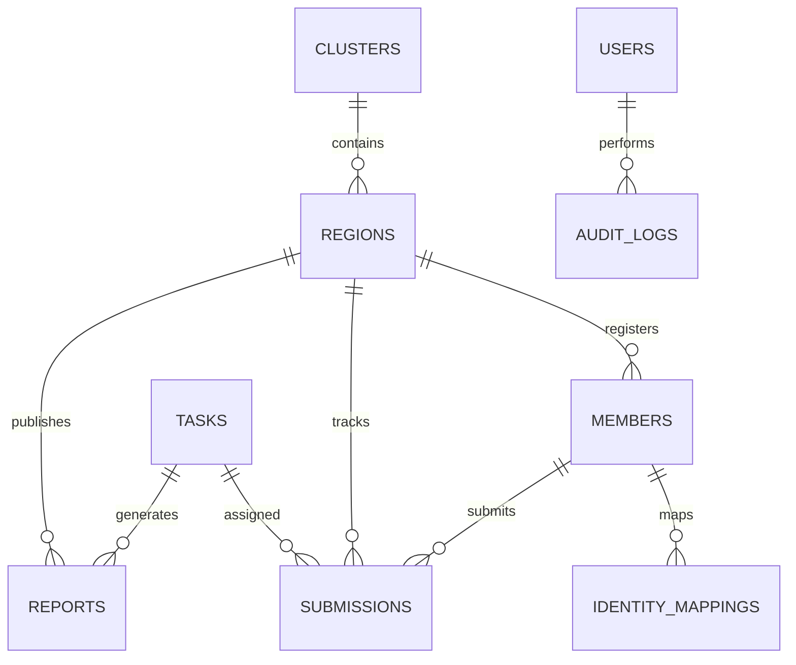
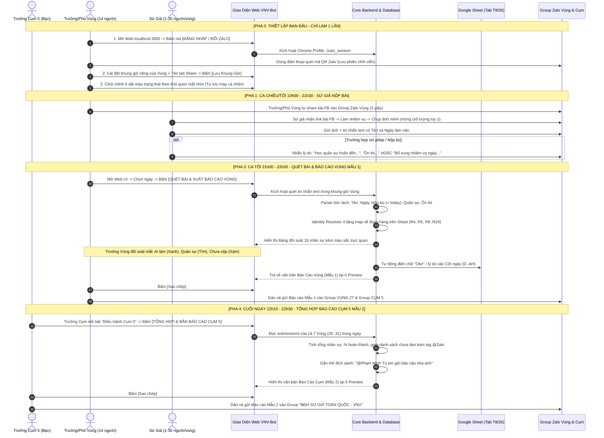

# TÀI LIỆU TOÀN DIỆN HỆ THỐNG VNV-BOT V2
## BẢN ĐẶC TẢ KIẾN TRÚC, QUY TRÌNH NGHIỆP VỤ, CƠ SỞ DỮ LIỆU & HIỆN TRẠNG KỸ THUẬT

> **Tài liệu phục vụ:** Trưởng Cụm 5 (Solution Architect / Tech Lead) rà soát, hiệu chỉnh và định hướng hoàn thiện hệ thống.  
> **Phiên bản hiện tại của mã nguồn:** 2.0.0  
> **Môi trường vận hành mục tiêu:** Windows Local PC (Node.js v18+, SQLite3, Chrome/Edge, Google Sheets API, Zalo Web Automation).  
> **Thời điểm trích xuất tài liệu:** Tháng 09/2026.

---

# MỤC LỤC

1. [Bối Cảnh Bài Toán & Triết Lý Vận Hành](#1-bối-cảnh-bài-toán--triết-lý-vận-hành)
2. [Kiến Trúc Kỹ Thuật Tổng Thể (System Architecture)](#2-kiến-trúc-kỹ-thuật-tổng-thể-system-architecture)
3. [Cấu Trúc Thư Mục & Vai Trò Từng File Mã Nguồn](#3-cấu-trúc-thư-mục--vai-trò-từng-file-mã-nguồn)
4. [Mô Hình Dữ Liệu Chi Tiết (Database Schema - 14 Bảng)](#4-mô-hình-dữ-liệu-chi-tiết-database-schema---14-bảng)
5. [Dữ Liệu Nhân Sự Thực Tế (Master Registry Vùng 27 & Cụm 5)](#5-dữ-liệu-nhân-sự-thực-tế-master-registry-vùng-27--cụm-5)
6. [Quy Trình & Luồng Hoạt Động Vận Hành Toàn Diện Cho Người Dùng (Operational Workflows)](#6-quy-trình--luồng-hoạt-động-vận-hành-toàn-diện-cho-người-dùng-operational-workflows)
   - [6.1. Bảng Phân Định Trách Nhiệm Vận Hành (RACI)](#61-bảng-phân-định-trách-nhiệm-vận-hành-raci--role-responsibilities)
   - [6.2. Sơ Đồ Luồng Hoạt Động Tổng Thể 24 Giờ (24h Operational Swimlane)](#62-sơ-đồ-luồng-hoạt-động-tổng-thể-24-giờ-24-hour-operational-swimlane)
   - [6.3. Chi Tiết Luồng Vận Hành Cho Từng Nhóm Người Dùng](#63-chi-tiết-luồng-vận-hành-cho-từng-nhóm-người-dùng)
     - [🅰️ Luồng Dành Cho Trưởng Vùng & Phó Vùng (14 người)](#luồng-dành-cho-trưởng-vùng--phó-vùng-14-người)
     - [🅱️ Luồng Dành Cho Trưởng Cụm 5 (Bạn - Nguyễn Thuận An)](#luồng-dành-cho-trưởng-cụm-5-bạn---nguyễn-thuận-an)
     - [🆎 Luồng Dành Cho Sứ Giả Trong Group Zalo Vùng](#luồng-dành-cho-sứ-giả-trong-group-zalo-vùng)
     - [⚙️ Luồng Xử Lý Nội Bộ Của Bot (Technical Data Pipeline)](#luồng-xử-lý-nội-bộ-của-bot-technical-data-pipeline)
7. [Giao Diện Web & Các Tính Năng Điều Hành (Web UI Features)](#7-giao-diện-web--các-tính-năng-điều-hành-web-ui-features)
8. [Danh Mục Chi Tiết API Endpoints](#8-danh-mục-chi-tiết-api-endpoints)
9. [Cơ Chế Chạy Ngầm (Cron Schedulers) vs Luồng Nút Bấm (On-Demand)](#9-cơ-chế-chạy-ngầm-cron-schedulers-vs-luồng-nút-bấm-on-demand)
10. [BẢNG PHÂN TÍCH KỸ THUẬT: CÁC ĐIỂM CHƯA ĐÚNG Ý HOẶC CẦN SỬA ĐỔI](#10-bảng-phân-tích-kỹ-thuật-các-điểm-chưa-đúng-ý-hoặc-cần-sửa-đổi)

---

# 1. BỐI CẢNH BÀI TOÁN & TRIẾT LÝ VẬN HÀNH

### 1.1. Cơ cấu tổ chức thực tế
* **Cụm 5 (Nhóm Thiện Nguyện VNV)** do **Nguyễn Thuận An (Trưởng Cụm)** trực tiếp chỉ đạo.
* Quản lý **7 Vùng**: Vùng 25, Vùng 26, Vùng 27, Vùng 28, Vùng 29, Vùng 30, Vùng 31.
* Quy mô: Mỗi vùng có 1 Trưởng Vùng, 1 Phó Vùng và **1–30 Sứ giả** (Tổng toàn cụm: **~114 nhân sự**).
* Người dùng trực tiếp của phần mềm: **~20 người (gồm: 1 Trưởng Cụm, 7 Trưởng Vùng, 7 Phó Vùng)**.

### 1.2. Triết lý vận hành: "Human-in-the-Loop & On-Demand" (Bán Tự Động)
* **KHÔNG tự động hóa 100% mù quáng:** Không để Bot tự quyết định bắn báo cáo sai lệch khi chưa có người duyệt.
* **Quyền kiểm soát thuộc về Trưởng/Phó Vùng:**
  - Khung giờ làm việc (Ca ngày / Ca tối) do từng Vùng tự cấu hình trên Web UI.
  - Các thao tác cốt lõi kích hoạt bằng **Nút Bấm Trực Tiếp (On-Demand Buttons)**:
    - Bấm nút $\rightarrow$ Mới lấy bài chia sẻ. (Nếu không bấm, Trưởng vùng tự share trên Zalo $\rightarrow$ Bot bỏ qua không báo lỗi).
    - Bấm nút $\rightarrow$ Mới quét bài, ghi Google Sheet và tạo văn bản Báo cáo Vùng Mẫu 1.
    - Bấm nút $\rightarrow$ Trưởng Cụm mới gom số liệu 7 Vùng tạo Báo cáo Cụm Mẫu 2 tag `@Phạm Minh Tú`.
* **Khắc phục triệt để lỗi của V1:**
  - V1 thất bại vì cuộn ngược Zalo tìm ngày (mất tin nhắn), cố gắng tải và OCR hàng trăm ảnh (nghẽn mạng, lỗi).
  - V2 khắc phục: **Chỉ đọc nội dung text của tin nhắn** (Sứ giả gửi 3+ ảnh luôn kèm text có tên và ngày nhiệm vụ), tra cứu bằng **từ điển ánh xạ danh tính cố định (Identity Registry)**.

---

# 2. KIẾN TRÚC KỸ THUẬT TỔNG THỂ (SYSTEM ARCHITECTURE)

```
┌─────────────────────────────────────────────────────────────────────────────────┐
│                           WINDOWS LOCAL PC OPERATOR                             │
│                  (Trình duyệt Chrome: http://localhost:3000)                    │
└──────────────────────────────────────┬──────────────────────────────────────────┘
                                       │ HTTP / REST / Cookie Session
                                       ▼
┌─────────────────────────────────────────────────────────────────────────────────┐
│                         NODE.JS / EXPRESS BACKEND SERVER                        │
│                                                                                 │
│  ┌──────────────────────┐  ┌───────────────────────┐  ┌──────────────────────┐  │
│  │   Routes & Auth      │  │  On-Demand Services   │  │   Parser & Mapping   │  │
│  │  - /api/v2/regions   │  │  - forwardTask()      │  │  - message_parser    │  │
│  │  - /api/v2/cluster   │  │  - scanAndReport()    │  │  - identity_resolver │  │
│  │  - /api/v2/zalo      │  │  - aggregateCluster() │  │  - reports_v2        │  │
│  └──────────┬───────────┘  └───────────┬───────────┘  └──────────┬───────────┘  │
│             │                          │                         │              │
│             └──────────────────────────┼─────────────────────────┘              │
│                                        ▼                                        │
│  ┌───────────────────────────────────────────────────────────────────────────┐  │
│  │                   SQLite DATABASE (data/vnv_bot.db)                       │  │
│  │   - members (Master Registry)     - submissions (Kết quả ngày)           │  │
│  │   - identity_mappings (Từ điển)   - reports (Văn bản Mẫu 1 & 2)           │  │
│  │   - regions (Cấu hình giờ 7 Vùng) - raw_events & zalo_message_queue       │  │
│  └───────────────────────────────────────────────────────────────────────────┘  │
└─────────────────────┬─────────────────────────────────────┬─────────────────────┘
                      │                                     │
       Puppeteer-Core │                                     │ Googleapis v4
       Profile Session│                                     │ Service Account / OAuth
                      ▼                                     ▼
     ┌────────────────────────────────┐    ┌─────────────────────────────────┐
     │      ZALO WEB AUTOMATION       │    │     GOOGLE SPREADSHEETS V4      │
     │      (https://chat.zalo.me)    │    │ (Ma trận tháng: Cột D..AH, R4..)│
     │  Profile: ./zalo_session       │    │ Spreadsheet ID: 1o36kM3Z6...    │
     │  - Group CỤM 5 (Nguồn bài)     │    │  - Tab: T8/26 (Vùng 27)         │
     │  - Group VÙNG 27 (Nộp bài)     │    │  - Ghi chuẩn: "Oke", lý do      │
     │  - Group BĐH (Tag @PhạmMinhTú) │    └─────────────────────────────────┘
     └────────────────────────────────┘
```

### Thành phần công nghệ (Tech Stack):
1. **Runtime:** Node.js (CommonJS modules).
2. **Web Framework:** Express 4.x, Cookie-parser, Express-session (lưu session vào SQLite bằng `connect-sqlite3`).
3. **Cơ sở dữ liệu:** SQLite3 (`data/vnv_bot.db`) chạy chế độ WAL (Write-Ahead Logging), hỗ trợ foreign keys.
4. **Tương tác Zalo:** `puppeteer-core` gắn với Google Chrome có sẵn trên Windows (`C:\Program Files\Google\Chrome\Application\chrome.exe`), lưu trữ thư mục phiên `./zalo_session`.
5. **Google Sheets:** Thư viện `googleapis` v4 kết hợp `google-auth-library` (hỗ trợ cả Service Account key JSON và Google OAuth2).
6. **Lập lịch (Legacy/Background):** `node-cron` quản lý các tác vụ backup DB và quét định kỳ nếu bật chế độ tự động.
7. **Frontend:** HTML5 Single Page Application, CSS3 Glassmorphism Theme (Dark/Light toggle), Vanilla JavaScript (không dùng React/Vue để nhẹ và chạy offline ngay lập tức).

---

# 3. CẤU TRÚC THƯ MỤC & VAI TRÒ TỪNG FILE MÃ NGUỒN

```
d:\Project\vnv_bot\
├── config/
│   ├── .env                    # Biến môi trường hệ thống (Port, Safe Mode, Google ID, Session Key)
│   └── .env.example            # Bản mẫu cấu hình
├── data/
│   └── vnv_bot.db              # File cơ sở dữ liệu SQLite chính của dự án
├── zalo_session/               # Thư mục lưu Profile Google Chrome (Cookies, Cache Zalo Web đã đăng nhập)
├── scripts/
│   ├── build_desktop.js        # Script đóng gói dự án ra bản Desktop portable
│   └── open_zalo_login.js      # Script mở cửa sổ Chrome thật để quét mã QR đăng nhập Zalo
├── src/
│   ├── index.js                # Điểm khởi động chính (Khởi tạo DB -> Tải Env -> Chạy App lắng nghe cổng 3000)
│   ├── app.js                  # Cấu hình Express app, middleware bảo mật, các route API chung
│   ├── config/
│   │   └── db.js               # Kết nối SQLite, hàm query helper (db.get, db.all, db.run), auto-migrate
│   ├── database/
│   │   ├── schema_v2.sql       # Lược đồ 14 bảng quan hệ hoàn chỉnh
│   │   └── seed_v2.sql         # Dữ liệu nạp mẫu chuẩn (19 nhân sự Vùng 27, 7 Vùng, 1 Cụm)
│   ├── middlewares/
│   │   └── auth.js             # Middleware xác thực đăng nhập, phân quyền (Admin, Cluster, Region)
│   ├── routes/
│   │   └── actions_v2.js       # Router chứa toàn bộ các endpoint On-Demand V2 (Forward, Report, Zalo Login)
│   ├── services/
│   │   ├── on_demand_actions.js    # Dịch vụ cốt lõi điều phối 3 nút bấm (Forward, Quét Vùng, Gom Cụm)
│   │   ├── message_parser.js       # Bộ phân tích cú pháp tin nhắn Sứ giả (Text, ngày, lý do, nộp bù)
│   │   ├── identity_resolver.js    # Bộ 4 tầng ánh xạ tên Zalo về Họ tên Google Sheet
│   │   ├── sheet_matrix_sync.js    # Dịch vụ tính toán tọa độ ô ma trận (Cột D..AH, Hàng R4..R24) và ghi Sheet
│   │   ├── reports_v2.js           # Bộ sinh văn bản Báo cáo Vùng Mẫu 1 và Báo cáo Cụm 5 Mẫu 2
│   │   ├── zalo_browser_manager.js # Dịch vụ điều khiển Puppeteer mở cửa sổ Zalo Web quét QR
│   │   ├── state_machine.js        # Quản lý trạng thái vòng đời ngày (IDLE -> FORWARDED -> EVALUATED -> ...)
│   │   └── zalo/
│   │       ├── puppeteer_worker.js # Worker theo dõi DOM Zalo Web (MutationObserver) & gõ phím gửi tin
│   │       └── pipeline.js         # Hàng đợi xử lý tin nhắn bất đồng bộ chống trùng lặp
│   ├── tests/
│   │   ├── browser_full_features.test.js # Test tự động 22 kịch bản trên trình duyệt Chrome thật
│   │   ├── actions_v2_e2e.test.js        # Test tích hợp luồng nghiệp vụ On-Demand
│   │   └── system_design_v2.test.js      # Test kiểm tra tính toàn vẹn kiến trúc và DB
│   └── web/
│       ├── index.html          # Giao diện điều hành (Bảng Điều Hành Vùng, Bảng Điều Hành Cụm 5, Admin)
│       ├── main.js             # Mã nguồn JavaScript frontend xử lý API, tương tác bảng, 6 màu trạng thái
│       └── style.css           # Giao diện CSS hiện đại, hỗ trợ Dark Mode
└── package.json                # Danh sách thư viện và npm scripts
```

---

# 4. MÔ HÌNH DỮ LIỆU CHI TIẾT (DATABASE SCHEMA - 14 BẢNG)

Lược đồ dữ liệu được thiết kế tập trung trong file `src/database/schema_v2.sql`:



### Danh sách chi tiết 14 bảng:
1. **`users`**: Tài khoản quản trị nội bộ đăng nhập Web (`admin`, `cluster_leader`, `region_leader`). Mật khẩu mã hóa bcryptjs, hỗ trợ cả Google OAuth.
2. **`clusters`**: Quản lý Cụm. Hiện tại: `id = 5`, `cluster_name = 'Cụm 5'`, `leader_name = 'Nguyễn Thuận An'`.
3. **`regions`**: Quản lý 7 Vùng (ID 25 đến 31). Lưu cấu hình khung giờ riêng từng vùng (`task_start_time`, `task_end_time`, `report_start_time`, `report_end_time`), tên tab Google Sheet (`sheet_name`), Zalo Group ID.
4. **`members` (Bảng trọng yếu - Master Registry)**:
   - Danh sách nhân sự chuẩn hóa theo đúng thứ tự Google Sheet.
   - Các trường cốt lõi: `region_id`, `sheet_row_index` (vị trí hàng vật lý trên sheet: R4, R5, R8..), `real_name` (họ tên chuẩn), `role` (`LEADER`, `DEPUTY`, `EMISSARY`), `join_date`.
5. **`identity_mappings` (Từ điển ánh xạ Zalo $\leftrightarrow$ Sheet)**:
   - Lưu trữ các biến thể tên của Sứ giả: `member_id`, `zalo_user_id`, `zalo_display_name` ("Thanh Trà ❤️"), `normalized_alias` ("thanh tra"), `confidence_score`.
6. **`raw_events`**: Lưu trữ mọi tin nhắn thô đọc được từ Zalo để làm bằng chứng kiểm toán (Audit Trail) và chống mất dữ liệu khi bot crash.
7. **`tasks`**: Lưu trữ nhiệm vụ ngày được phát hành (`task_code` định dạng `TSK-C5-YYYYMMDD-01`, link Facebook, nội dung).
8. **`submissions` (Bảng lưu kết quả nộp bài hàng ngày)**:
   - Khóa duy nhất: `UNIQUE(work_date, member_id)`.
   - Trạng thái `status`:
     - `OK`: Đã hoàn thành (được ghi "Oke" lên Sheet).
     - `NO_RESPONSE`: Chưa nộp / không phản hồi (để ô trống trên Sheet).
     - `LATE_REQUEST`: Xin làm muộn / xin phép (ghi lý do lên Sheet).
     - `SUPPLEMENT`: Nộp bù ngày cũ (đưa vào mục 7 của Báo cáo).
     - `OFF`: Xin nghỉ hoạt động.
   - `notes`: Chuỗi lý do (ví dụ: *"Học quân sự nên hoãn đến 10/08/2026"*).
   - `supplement_dates_json`: Mảng JSON chứa các ngày nộp bù (ví dụ `["2026-08-18", "2026-08-19"]`).
   - `sheet_synced`: Đánh dấu 0/1 đã đồng bộ lên Google Sheet thành công hay chưa.
9. **`reports`**: Lưu trữ nội dung văn bản báo cáo đã sinh (Mẫu 1 và Mẫu 2) kèm số lượng thống kê `total_completed`, `total_incomplete`.
10. **`daily_operations`**: Máy trạng thái theo dõi tiến trình ngày (`IDLE` $\rightarrow$ `TASK_FORWARDED` $\rightarrow$ `EVALUATED` $\rightarrow$ `SHEET_SYNCED` $\rightarrow$ `REPORTS_DISPATCHED`).
11. **`zalo_message_queue`**: Hàng đợi gửi tin nhắn Zalo bất đồng bộ với cơ chế retry khi gặp lỗi mạng.
12. **`local_config`**: Lưu trữ cấu hình key-value tùy biến cục bộ.
13. **`audit_logs`**: Nhật ký ghi vết mọi hành vi người dùng (đăng nhập, sửa giờ, bấm quét bài, ghi sheet).
14. **`schema_migrations`**: Quản lý phiên bản nâng cấp cấu trúc database tự động.

---

# 5. DỮ LIỆU NHÂN SỰ THỰC TẾ (MASTER REGISTRY VÙNG 27 & CỤM 5)

Theo liên kết Google Sheet thực tế của Vùng 27 (Tab `T8/26`):  
`https://docs.google.com/spreadsheets/d/1o36kM3Z68ZqAId7YxfC4Nnoq8RRO-xhQSls-lNXfgds/edit?gid=1065763286#gid=1065763286`

Cơ sở dữ liệu đã nạp chuẩn xác **19 nhân sự của Vùng 27** ứng với số hàng trên trang tính:

| STT | Vị trí Hàng Sheet (`sheet_row_index`) | Họ và Tên Chuẩn (`real_name`) | Vai Trò | Nickname Zalo Đã Mapped |
| :---: | :---: | :--- | :---: | :--- |
| 1 | **Hàng 4** | **Phạm Quang Đại** | Trưởng Vùng | Phạm Quang Đại, Quang Đại |
| 2 | **Hàng 5** | **Nguyễn Thị Thanh Trà** | Phó Vùng | Thanh Trà, Trà Nguyễn, Thanh Trà ❤️ |
| - | *Hàng 6-7* | *(Dòng tiêu đề bảng trên Sheet)* | - | - |
| 3 | **Hàng 8** | Nguyễn Thị Phương Trinh | Sứ giả | Phương Trinh, Trinh Nguyễn |
| 4 | **Hàng 9** | Thàn Thị Quỳnh Nhi | Sứ giả | Quỳnh Nhi |
| 5 | **Hàng 10** | Nguyễn Thị Yến Nhi | Sứ giả | Yến Nhi |
| 6 | **Hàng 11** | Cù Ngọc Quỳnh | Sứ giả | Cù Quỳnh, Quỳnh Cù |
| 7 | **Hàng 12** | Phan Văn Lãm | Sứ giả | Phan Lãm |
| 8 | **Hàng 13** | Nguyễn Tiến Dũng | Sứ giả | Tiến Dũng |
| 9 | **Hàng 14** | Huỳnh Kim Ngân | Sứ giả | Kim Ngân |
| 10 | **Hàng 15** | Mai Thị Thủy | Sứ giả | Mai Thủy |
| 11 | **Hàng 16** | Nguyễn Anh Hoàng Phúc | Sứ giả | Hoàng Phúc |
| 12 | **Hàng 17** | Trần Thị Như Ý | Sứ giả | Như Ý |
| 13 | **Hàng 18** | Đỗ Phương Vy | Sứ giả | Phương Vy |
| 14 | **Hàng 19** | Trần Lê Bích Thảo | Sứ giả | Bích Thảo |
| 15 | **Hàng 20** | Dương Quỳnh Như | Sứ giả | Quỳnh Như |
| 16 | **Hàng 21** | Nguyễn Thị Kiều Trang | Sứ giả | Kiều Trang |
| 17 | **Hàng 22** | Mai Thị Thúy Vân | Sứ giả | Thúy Vân |
| 18 | **Hàng 23** | Nguyễn Hoàng Anh | Sứ giả | Hoàng Anh |
| 19 | **Hàng 24** | Nguyễn Ngọc Bảo Trâm | Sứ giả | Bảo Trâm |

> [!NOTE]
> Các Vùng 25, 26, 28, 29, 30, 31 hiện tại đang có dữ liệu cấu hình vùng trong bảng `regions`, nhưng danh sách nhân sự chi tiết trong bảng `members` đang là dữ liệu mẫu khởi tạo. Khi triển khai chính thức cần nạp từ các tab sheet tương ứng của từng vùng.

---

# 6. QUY TRÌNH & LUỒNG HOẠT ĐỘNG VẬN HÀNH TOÀN DIỆN CHO NGƯỜI DÙNG (OPERATIONAL WORKFLOWS)

> [!IMPORTANT]
> Phần này mô tả chi tiết **TỪNG BƯỚC THAO TÁC THỰC TẾ** của đội ngũ ~20 người dùng (Trưởng Cụm, 7 Trưởng Vùng, 7 Phó Vùng) và Sứ giả, kết hợp với các phản ứng kỹ thuật tương ứng của Bot.

---

### 6.1. Bảng Phân Định Trách Nhiệm Vận Hành (RACI & Role Responsibilities)

| Đối Tượng | Số Lượng | Trách Nhiệm Chính Trên Hệ Thống | Công Cụ & Môi Trường Tương Tác |
| :--- | :---: | :--- | :--- |
| **Trưởng Cụm 5 (Bạn)** | 1 | - Giám sát tổng thể 7 Vùng.<br>- Cấu hình tài khoản, danh bạ nhân sự Master.<br>- Cuối ngày: Bấm tổng hợp và gửi Báo cáo Cụm Mẫu 2 lên Ban Điều Hành. | - Web UI (`/panel-cluster-workspace`)<br>- Group Zalo `BĐH SỨ GIẢ TOÀN QUỐC - VNV` |
| **Trưởng & Phó Vùng** | 14 (2 người/vùng) | - Cài đặt khung giờ làm việc riêng của Vùng.<br>- Bấm lấy & chia sẻ nhiệm vụ ca trưa (tùy chọn).<br>- Ca tối: Bấm quét bài, đối soát nhân sự trên Web UI, tự động ghi Google Sheet và xuất Báo cáo Vùng Mẫu 1. | - Web UI (`/panel-region-workspace`)<br>- Group Zalo của từng Vùng & Group `CỤM 5` |
| **Sứ Giả** | 1–30 người/vùng | - Nhận link FB làm nhiệm vụ.<br>- Gửi minh chứng (3+ ảnh) kèm text đúng cú pháp (Tên + Ngày) vào Group Vùng. | - Ứng dụng Zalo Mobile / Desktop<br>- Group Zalo của Vùng |
| **Hệ Thống VNV-Bot** | 1 | - Cung cấp giao diện Web trực quan (`localhost:3000`).<br>- Bóc tách ngữ nghĩa text tin nhắn, ánh xạ tên Zalo về Google Sheet.<br>- Tự động tính toán tọa độ ma trận ô (D..AH, R4..) để ghi Sheet.<br>- Sinh văn bản Báo cáo Mẫu 1 và Mẫu 2 chuẩn xác trong 0.5s. | - Backend Node.js / SQLite / Puppeteer / Google Sheets API |

---

### 6.2. Sơ Đồ Luồng Hoạt Động Tổng Thể 24 Giờ (24-Hour Operational Swimlane)



---

### 6.3. Chi Tiết Luồng Vận Hành Cho Từng Nhóm Người Dùng

#### 🅰️ LUỒNG DÀNH CHO TRƯỞNG VÙNG & PHÓ VÙNG (14 NGƯỜI)

* **Bước 1: Thiết lập ban đầu (Chỉ làm 1 lần trên máy tính cá nhân):**
  1. Truy cập `http://localhost:3000` trên trình duyệt Chrome/Edge.
  2. Đăng nhập tài khoản điều hành Vùng (ví dụ tài khoản Vùng 27).
  3. Bấm nút màu xanh **`[ĐĂNG NHẬP / ĐỔI ZALO]`** $\rightarrow$ Trình duyệt Chrome thật tự động mở ra trang `chat.zalo.me` $\rightarrow$ Lấy điện thoại quét mã QR. Từ nay phiên Zalo được duy trì vĩnh viễn trên máy tính.
  4. Tại card **Khung Giờ Hoạt Động Của Vùng**: Nhập giờ ca ngày (vd `10:00` - `15:00`), giờ ca tối (vd `21:00` - `22:30`), tab Sheet (vd `T8/26`) $\rightarrow$ Bấm nút **`[Lưu Khung Giờ]`**.
  5. Tại thanh **Bảng Màu Trạng Thái**: Click vào từng dải ô màu để chọn màu hiển thị ưa thích (vd đổi *Làm muộn* thành màu Cam/Đỏ). Màu này tự động lưu trên máy Trưởng Vùng.

* **Bước 2: Ca ngày (10h00 – 15h00) - Chia sẻ nhiệm vụ:**
  - Trưởng/Phó Vùng thấy bài viết từ Group `CỤM 5` hoặc `TỔNG BĐH KÊNH SỨ GIẢ - VNV` $\rightarrow$ Tự bấm Chuyển tiếp (Share) trên app Zalo vào Group Vùng (thao tác chưa đến 3 giây, cực nhanh và tiện, không cần thông qua Bot).

* **Bước 3: Ca tối (21h00 – 22h30) - Quét bài & Báo cáo Vùng Mẫu 1:**
  1. Trưởng/Phó Vùng vào lại Web UI `localhost:3000` $\rightarrow$ Chọn ngày làm việc (mặc định hôm nay).
  2. Bấm nút màu xanh lá **`[QUÉT BÀI & XUẤT BÁO CÁO VÙNG]`**.
  3. Hệ thống lập tức thực hiện 3 hành động song song:
     - **Phân tích tin nhắn:** Đọc toàn bộ tin nhắn text trong khung giờ Vùng, lọc tên Sứ giả và ngày nộp.
     - **Hiển thị Bảng đối soát nhân sự:** 19 dòng hiện lên rõ ràng:
       - Sứ giả đã gửi bài $\rightarrow$ Badge **Oke (Màu xanh)**.
       - Sứ giả nhắn đi học quân sự $\rightarrow$ Badge **Đi quân sự (Màu tím)** kèm ghi chú.
       - Sứ giả nhắn nộp bù ngày cũ $\rightarrow$ Badge **Làm muộn/Bổ sung (Màu vàng)**.
       - Sứ giả không nhắn gì $\rightarrow$ Badge **Chưa nộp (Màu xám)**.
     - **Ghi trực tiếp vào Google Sheet:** Tự động điền chữ `"Oke"` vào đúng cột ngày (ví dụ ngày 20 điền vào Cột `W`, hàng R4, R5, R8..R24). Các ô chưa nộp để trống.
  4. Khung **Xem Trước Báo Cáo Vùng (Mẫu 1)** tự động điền sẵn văn bản hoàn chỉnh 7 mục (Trưởng vùng, Phó vùng, Tổng số, Đã xong, Chưa xong kèm tag, Xin phép, Bổ sung).
  5. Trưởng Vùng bấm nút **`[Sao chép]`** $\rightarrow$ Dán vào Group Zalo của Vùng mình và gửi 1 bản vào Group `CỤM 5` để Trưởng Cụm nắm số liệu.

---

#### 🅱️ LUỒNG DÀNH CHO TRƯỞNG CỤM 5 (BẠN - NGUYỄN THUẬN AN)

* **Bước 1: Giám sát trong ngày:**
  - Theo dõi trên Dashboard tiến độ tổng thể của 7 Vùng (Vùng 25 đến 31).
  - Có thể vào từng Vùng kiểm tra xem Trưởng/Phó Vùng đã lưu khung giờ và chạy báo cáo hay chưa.

* **Bước 2: Cuối ngày (22h15 – 22h30) - Chốt Báo cáo Cụm 5 gửi Ban Điều Hành:**
  1. Chờ các Vùng hoàn thành ca báo cáo Vùng (thông thường trước 22h15).
  2. Trên menu bên trái, Trưởng Cụm bấm vào mục **"Điều Hành Cụm 5"** (`#panel-cluster-workspace`).
  3. Bấm nút lớn màu tím: **`[TỔNG HỢP & BẮN BÁO CÁO CỤM 5]`**.
  4. Hệ thống tự động:
     - Gom toàn bộ số liệu nộp bài trong ngày của 7 Vùng (tổng ~114 nhân sự).
     - Thống kê tỷ lệ hoàn thành %, thống kê số lượng từng Vùng (Vùng 25: x/y, Vùng 27: 17/19...).
     - Lọc toàn bộ Sứ giả chưa nộp bài của cả 7 Vùng, tự động gắn tiền tố `@` trước tên Zalo để phục vụ tag tên nhắc nhở.
     - Tự động bổ sung câu chào và tag người phụ trách toàn quốc:  
       `@Phạm Minh Tú em gửi báo cáo nha anh`.
  5. Nội dung Báo cáo Cụm Mẫu 2 hiện ngay tại ô Preview Text. Trưởng Cụm bấm nút **`[Sao chép]`** $\rightarrow$ Mở Group Zalo `BĐH SỨ GIẢ TOÀN QUỐC - VNV` và dán gửi đi. Hoàn tất công việc trong ngày!

---

#### 🆎 LUỒNG DÀNH CHO SỨ GIẢ TRONG GROUP ZALO VÙNG

1. **Nhận nhiệm vụ:** Sứ giả thấy tin nhắn phân phối nhiệm vụ trong Group Zalo Vùng lúc trưa $\rightarrow$ Bấm link Facebook để like, share, comment theo yêu cầu.
2. **Nộp bài đúng quy định:**
   - Chụp lại minh chứng (số lượng ảnh tùy ý theo từng nhiệm vụ, Bot hoàn toàn không tải và không đếm ảnh).
   - Gửi ảnh vào Group Zalo Vùng.
   - **BẮT BUỘC gửi kèm tin nhắn văn bản có TÊN và NGÀY:**
     - *Ví dụ mẫu 1:* `Nguyễn Anh Hoàng Phúc gửi báo cáo nhiệm vụ 16/06/2026`
     - *Ví dụ mẫu 2:* `Phản hồi hoàn thành nhiệm vụ T4 ngày 17/6/2026 - Nguyễn Ngọc Bào Trâm`
     - Hoặc các từ khóa ngắn gọn: `Hoàn thành nhiệm vụ`, `DONE`, `Oke`.
3. **Trường hợp xin phép / Hoãn / Nộp bù ngày hôm trước:**
   - **Tự động nhận diện nộp bù (KHÔNG CẦN chữ "bổ sung"):**
     - Ví dụ: Hôm nay ngày 17/06, sứ giả nhắn `Nguyễn Anh Hoàng Phúc gửi báo cáo 16/06`.
     - Bot so sánh thấy `16/06 < 17/06` $\rightarrow$ **Tự động nhận diện là nộp bù ngày cũ**.
     - Bot tự động tìm sang cột ngày cũ (16/06) trên Google Sheet điền `"Oke"`, đồng thời đưa vào mục **"7. Bổ sung:"** của báo cáo hôm nay.
   - **Xin hoãn quân sự:** `Học quân sự nên hoãn đến 10/08/2026` $\rightarrow$ Bot ghi nhận lý do quân sự vào Sheet và đưa vào mục 6. Xin phép.
   - **Xin nghỉ ôn thi / ốm:** `Em xin phép ôn thi THPT` hoặc `Em nằm viện xin nghỉ` $\rightarrow$ Ghi chú lý do tương ứng.

---

#### ⚙️ LUỒNG XỬ LÝ NỘI BỘ CỦA BOT (TECHNICAL DATA PIPELINE)

```
[Tin nhắn Zalo trong Group]
          │
          ▼
1. TÁCH LỌC TEXT: Bỏ qua các file ảnh nặng, chỉ lấy string text
          │
          ▼
2. BỘ MÁY PARSER (message_parser.js):
   - Regex trích xuất danh sách ngày: extractDatesFromText(content)
   - Kiểm tra ngày < today -> Phân loại SUPPLEMENT (Bổ sung ngày cũ)
   - Regex trích xuất lý do: "quân sự", "ôn thi", "nhập viện", "xin off"
   - Cú pháp báo cáo: "gửi báo cáo", "hoàn thành", "done" -> Phân loại OK
          │
          ▼
3. BỘ MÁY IDENTITY RESOLVER 4 TẦNG (identity_resolver.js):
   - Tầng 1: So khớp họ tên thật xuất hiện trong text tin nhắn (Độ tin cậy 99%)
   - Tầng 2: So khớp Zalo User ID cố định
   - Tầng 3: So khớp Nickname đã lưu trong DB (identity_mappings)
   - Tầng 4: Chuẩn hóa tiếng Việt bỏ dấu + Token matching ("Thanh Trà ❤️" -> "Nguyễn Thị Thanh Trà")
          │
          ▼
4. LƯU KẾT QUẢ VÀO SQLITE (submissions table):
   - Ghi nhận trạng thái: OK / LATE_REQUEST / SUPPLEMENT / NO_RESPONSE / OFF
          │
          ▼
5. ĐỒNG BỘ MA TRẬN GOOGLE SHEET (sheet_matrix_sync.js):
   - Tọa độ cột: ColIndex = 3 + DayNumber (Ngày 1 = Cột D, Ngày 19 = Cột V, Ngày 31 = Cột AH)
   - Tọa độ hàng: R4, R5, R8..R24 theo sheet_row_index
   - Batch Update 1 lần cả cột: Ghi chữ "Oke", lý do, hoặc để trống
          │
          ▼
6. XUẤT BẢN BÁO CÁO TEXT (reports_v2.js):
   - Sinh Báo cáo Vùng Mẫu 1 (7 mục chuẩn)
   - Sinh Báo cáo Cụm Mẫu 2 (Gom 7 vùng + Tag @Phạm Minh Tú)
```

---

# 7. GIAO DIỆN WEB & CÁC TÍNH NĂNG ĐIỀU HÀNH (WEB UI FEATURES)

Giao diện Web hoạt động tại `http://localhost:3000`:

1. **Bảng Điều Hành Vùng (`#panel-region-workspace`)**:
   - **Thanh công cụ đỉnh:** Nút **[Đăng Nhập / Đổi Zalo]** (xanh Zalo), Bộ chọn Vùng (25 đến 31), Bộ chọn Ngày làm việc.
   - **Card Cài Đặt Khung Giờ:** Cho phép Trưởng/Phó Vùng tự sửa giờ Ca Ngày (10:00 - 15:00), Ca Tối (21:00 - 22:30), Tên tab Sheet (`T8/26`) và bấm **[Lưu Khung Giờ]** (lưu thẳng vào database SQLite).
   - **Thanh 6 Dải Màu Trạng Thái Tùy Chỉnh:**
     - 6 ô màu: 🟢 Hoàn thành (Oke), 🟡 Làm muộn/Bổ sung, ⚪ Chưa nộp, 🟣 Đi quân sự, 🌸 Ôn thi/Đi viện, 🔴 Xin nghỉ (Off).
     - Người dùng **click trực tiếp vào ô màu để đổi màu tùy ý** (ví dụ đổi *"Làm muộn"* thành màu Đỏ).
     - Màu sắc tự động lưu vào `localStorage` trên máy tính của người dùng và cập nhật màu badge trên bảng nhân sự ngay lập tức.
   - **Bảng Đối Soát 19 Nhân Sự:** Hiển thị rõ STT, Hàng Sheet (R4, R5, R8..), Họ tên, Nickname Zalo, Vai trò, Badge trạng thái màu và Ghi chú lý do.
   - **Khung Xem Trước Báo Cáo Vùng (Mẫu 1):** Khung textarea hiển thị báo cáo hoàn chỉnh kèm nút **[Sao chép]** vào clipboard chỉ bằng 1 click.
2. **Bảng Điều Hành Cụm 5 (`#cluster-workspace`)**:
   - Nút **[TỔNG HỢP & BẮN BÁO CÁO CỤM 5]**.
   - Khung xem trước Báo cáo Cụm Mẫu 2 kèm nút **[Sao chép]**.
3. **Các tính năng nền tảng khác:**
   - Nút chuyển đổi giao diện Sáng / Tối (**Dark / Light Theme Toggle**).
   - Đăng nhập bảo mật nội bộ (mặc định `admin` / `admin`).
   - Các bảng quản trị phụ: Xem danh sách bài nộp chi tiết, xem lịch sử báo cáo, quản lý sứ giả, quản lý danh sách cụm/vùng.

---

# 8. DANH MỤC CHI TIẾT API ENDPOINTS

Tất cả các API On-Demand mới phục vụ quy trình vận hành được định nghĩa tại `src/routes/actions_v2.js`:

| Method | Đường dẫn API | Chức năng & Tham số | Kết quả trả về |
| :--- | :--- | :--- | :--- |
| **POST** | `/api/v2/zalo/open-login` | Mở cửa sổ Chrome thật chạy `chat.zalo.me` để quét mã QR | `{ success: true, message: 'Đã mở cửa sổ Zalo...' }` |
| **GET** | `/api/v2/zalo/status` | Kiểm tra thư mục `./zalo_session` đã có dữ liệu đăng nhập chưa | `{ success: true, data: { hasSession, isRunning } }` |
| **GET** | `/api/v2/regions` | Lấy danh sách 7 Vùng kèm số lượng thành viên và khung giờ | `{ success: true, data: [ { id: 27, region_name: "Vùng 27", ... } ] }` |
| **POST** | `/api/v2/regions/:id/settings` | Cập nhật khung giờ và tên tab sheet của vùng. Body: `{ task_start_time, task_end_time, report_start_time, report_end_time, sheet_name }` | `{ success: true, message: 'Đã cập nhật...', data }` |
| **GET** | `/api/v2/regions/:id/members` | Lấy 19 nhân sự của Vùng kèm trạng thái nộp bài ngày `?date=YYYY-MM-DD` | `{ success: true, regionId: 27, data: [ { real_name, sheet_row_index, submission_status, ... } ] }` |
| **POST** | `/api/v2/regions/:id/forward-task` | Ca ngày: Lấy nhiệm vụ và forward vào group Vùng. Body: `{ workDate, taskContent, sourceGroup }` | `{ success: true, message: 'Đã chia sẻ...', data: { taskCode, ... } }` |
| **POST** | `/api/v2/regions/:id/run-report` | Ca tối: Quét tin nhắn, điền ma trận Google Sheet và tạo Báo cáo Mẫu 1. Body: `{ workDate, simulatedMessages, dryRun }` | `{ success: true, data: { completed, totalMembers, sheetRange, reportContent } }` |
| **POST** | `/api/v2/cluster/run-report` | Cuối ngày: Tổng hợp dữ liệu 7 Vùng tạo Báo cáo Mẫu 2 tag Tú. Body: `{ workDate, dryRun }` | `{ success: true, data: { totalMembers, totalCompleted, reportContent } }` |
| **GET** | `/api/v2/preview/report` | Lấy nội dung xem trước báo cáo text mà không ghi DB/Sheet. Query: `?type=region|cluster&regionId=27&workDate=...` | `{ success: true, content: "..." }` |

---

# 9. CƠ CHẾ CHẠY NGẦM (CRON SCHEDULERS) VS LUỒNG NÚT BẤM (ON-DEMAND)

Hệ thống hiện tại có sự đan xen giữa 2 tư duy thiết kế:

1. **Tư duy cũ (Thuần Cron tự động trong `src/scheduler/`):**
   - File `src/scheduler/index.js` lên lịch 6 jobs chạy ngầm theo giờ cố định:
     - `backupDb.job.js`: Sao lưu DB lúc 02:00 sáng.
     - `distribute.job.js`: Tự động bắn nhiệm vụ lúc 10:00 sáng.
     - `summarize.job.js`: Tự động tổng hợp kết quả lúc 21:30 tối.
     - `syncSheets.job.js`: Tự động ghi Sheet lúc 22:00 tối.
     - `sendReports.job.js`: Tự động gửi báo cáo lúc 22:15 tối.
     - `zaloRefreshToken.job.js`: Làm mới token Zalo OA.
   - *Hạn chế của tư duy này:* Mỗi Vùng có khung giờ nộp bài khác nhau, tiến độ sứ giả thất thường, nếu chạy cứng nhắc theo giờ Cron thì báo cáo sẽ bị thiếu bài hoặc sai sót mà Trưởng vùng không kịp can thiệp.

2. **Tư duy mới (On-Demand Buttons trong `src/routes/actions_v2.js`):**
   - Tách rời hoàn toàn khỏi lịch cứng: Trưởng Vùng rảnh lúc 21:15 thì bấm lúc 21:15, 22:00 bấm lúc 22:00.
   - Bấm nút $\rightarrow$ Quét bài $\rightarrow$ Kiểm tra mắt trên bảng nhân sự $\rightarrow$ Thấy đúng mới bấm xuất báo cáo.
   - Đây là luồng đang được ưu tiên và tích hợp hoàn chỉnh trên Web UI hiện tại.

---

# 10. BẢNG PHÂN TÍCH KỸ THUẬT: CÁC ĐIỂM CHƯA ĐÚNG Ý HOẶC CẦN SỬA ĐỔI

> [!IMPORTANT]
> Đây là phần trọng tâm để bạn (Trưởng Cụm / Solution Architect) trực tiếp rà soát, đánh giá và chỉ đạo sửa đổi code theo đúng ý bạn:

| # | Hạng mục kỹ thuật | Hiện trạng code đang làm | Điểm có thể chưa đúng ý bạn | Đề xuất hướng điều chỉnh |
| :-: | :--- | :--- | :--- | :--- |
| **1** | **Cách lấy tin nhắn Zalo lúc bấm Quét bài** | Khi bấm nút `[QUÉT BÀI]`, hàm `scanAndReportRegion` đọc tin nhắn từ bảng `raw_events` trong SQLite (hoặc mảng giả lập `simulatedMessages`). | Chưa có cầu nối trực tiếp để tại khoảnh khắc bấm nút, Bot tự động nhảy vào cửa sổ Zalo Web đang mở, cuộn lấy các tin nhắn mới nhất trong ngày của group đó rồi mới nạp vào DB. | Bổ sung hàm Puppeteer: `scrapeGroupMessages(groupName, fromTime, toTime)` để cào trực tiếp từ DOM Zalo Web ngay khi người dùng click nút. |
| **2** | **Cơ chế bắn tin nhắn Báo cáo lên Zalo** | Sau khi tạo Báo cáo Mẫu 1 và Mẫu 2, hệ thống hiển thị văn bản ra khung Preview Text, cung cấp nút **[Sao chép]**, và ghi bản ghi vào bảng `zalo_message_queue`. | Hiện tại chưa tự động kích hoạt Puppeteer tìm ô chat của group Vùng / group BĐH để gõ phím và Enter gửi đi ngay lập tức. | Tích hợp hàm `sendZaloMessageViaPuppeteer(groupName, text)` trực tiếp vào nút bấm hoặc thêm nút toggle *"Tự động gửi vào Zalo sau khi xuất"*. |
| **3** | **Cấu hình Google Sheets thực tế** | Code đã có hàm `syncRegionMatrixSheet` tính đúng cột $3+N$ và hàng R4..R24, nhưng đang bật `SAFE_MODE=true` (ghi nhận cục bộ fallback). | Cần cấp quyền chỉnh sửa cho Service Account Google (`client_email`) trên file Google Spreadsheet thật của Vùng để ghi trực tiếp lên đám mây. | Cung cấp file `credentials.json` hoặc dùng tài khoản Google OAuth đã đăng nhập để tắt `SAFE_MODE` khi chạy thật. |
| **4** | **Dữ liệu nhân sự 6 Vùng còn lại (25, 26, 28, 29, 30, 31)** | Database hiện tại chỉ mới nạp đúng 19 nhân sự thật của Vùng 27 (theo tab `T8/26`). Các vùng khác đang dùng 2 thành viên mẫu. | Báo cáo Cụm 5 Mẫu 2 cần gom đủ số liệu thực tế của cả 114 thành viên thuộc 7 Vùng. | Cung cấp danh sách hoặc quyền đọc các tab Vùng khác trên Google Sheet để import đầy đủ 114 người vào bảng `members`. |
| **5** | **Mô hình cài đặt & Phân tán cho các Trưởng Vùng** | Toàn bộ hệ thống hiện đang chạy trên 1 máy tính duy nhất (`localhost:3000`). | Nếu 7 Trưởng Vùng muốn tự dùng: Hoặc họ phải truy cập vào IP máy chủ của bạn qua mạng LAN/VPN/Cloud, hoặc mỗi Trưởng Vùng tải 1 bản cài đặt độc lập về máy cá nhân của họ. | Thống nhất mô hình: (A) Trưởng Cụm chạy tập trung làm thay cả cụm; hay (B) Đóng gói ứng dụng Desktop portable gửi cho từng Trưởng Vùng. |
| **6** | **Xử lý các ngoại lệ cú pháp tin nhắn** | Parser đang dựa trên regex tên, ngày và các từ khóa (`báo cáo`, `done`, `oke`, `quân sự`...). | Nếu Sứ giả nhắn tin quá cẩu thả (ví dụ chỉ gửi icon 👍 hoặc nhắn không dấu sai chính tả nặng) thì Bot sẽ phân loại nhầm thành `NO_RESPONSE`. | Trưởng/Phó Vùng có thể click trực tiếp vào từng dòng nhân sự trên bảng Web UI để sửa nhanh trạng thái thủ công trước khi bấm xuất Báo cáo. |

---

# HƯỚNG DẪN BẠN HIỆU CHỈNH FILE NÀY

Bạn có thể:
1. Mở file `TAI_LIEU_TOAN_DIEN_VNV_BOT_V2.md` này trong editor.
2. Ghi chú trực tiếp vào các mục bạn thấy chưa đúng quy trình thực tế hoặc cần thay đổi kỹ thuật.
3. Nhắn lại cho tôi biết các điểm bạn muốn sửa đổi, tôi sẽ lập tức refactor code tương ứng!
